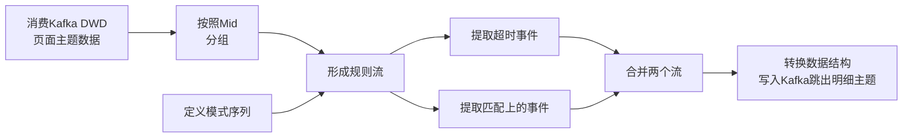
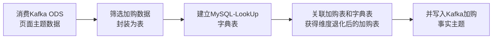

用户行为 采集平台


本项目收集和分析的用户行为信息主要有页面浏览记录、动作记录、曝光记录、启动记 录和错误记录

1. application.yml 文件
   1. 可以根据需求生成对应日期的用户行为日志。
2. path.json，该文件用来配置访问路径
   1. 根据需求，可以灵活配置用户点击路径。
3. logback 配置文件
   1. 可配置日志生成路径，修改内容如下

 集群日志生成脚本
1. 项目经验之 HDFS 存储多目录

   1. 在不同磁盘设置文件夹

   2. 在 hdfs-site.xml 文件中配置多目录，注意新挂载磁盘的访问权限问题

   4. 台服务器挂载的磁盘不一样，所以每个节点的多目录配置可以不一致。单独配置
``` xml
<property> 
	<name>dfs.datanode.data.dir</name>
	<value>file:///dfs/data1,file:///hd2/dfs/data2,file:///hd3/dfs/data3,file:///hd4/dfs/data4</value> 
</property>
```

1. 项目经验之集群数据均衡

   1. 节点间数据均衡

      某一个节点（hadoop102）用的多，数量多

      1. 开启数据均衡命令`start-balancer.sh -threshold 10`
      2. 停止数据均衡命令`stop-balancer.sh`

   2. 磁盘间数据均衡

      某一个磁盘用的多，数量多

      1. 生成均衡计划`hdfs diskbalancer -plan hadoop103`
      2. 执行均衡计划`hdfs diskbalancer -execute hadoop103.plan.json`
      3. 取消均衡任务`hdfs diskbalancer -cancel hadoop103.plan.json`

3. 项目经验之Hadoop 参数调优

   1. HDFS 参数调优 hdfs-site.xml

      1. NameNode 有一个工作线程池，用来处理不同 DataNode 的并发心跳以及客户端并发的元 数据操作。对于大 集群或 者有大 量客户 端的集 群来说 ，通常 需要增 大 参 数 dfs.namenode.handler.count 的默认值 10 。$20 \times \log _{e}^{\text {Cluster Size }}$

   2. YARN参数调优 yarn-site.xml

      1. 情景描述：总共 7 台机器，每天几亿条数据，数据源->Flume->Kafka->HDFS->Hive 

      2. 面临问题：数据统计主要用 HiveSQL，没有数据倾斜，小文件已经做了合并处理，开启的 JVM重用，而且 IO 没有阻塞，内存用了不到 50%。但是还是跑的非常慢，而且数据量洪 峰过来时，整个集群都会宕掉。基于这种情况有没有优化方案。 

      3. 解决办法：
         内存利用率不够。这个一般是 Yarn 的 2 个配置造成的，单个任务可以申请的最大内存大小，和 Hadoop 单个节点可用内存大小。调节这两个参数能提高系统内存的利用率。 

         （a）yarn.nodemanager.resource.memory-mb 表示该节点上 YARN 可使用的物理内存总量，默认是 8192（MB），注意，如果你的节点内存资源不够 8GB，则需要调减小这个值，而 YARN 不会智能的探测节点的物理内存总量。 
         （b）yarn.scheduler.maximum-allocation-mb 单个任务可申请的最多物理内存量，默认是 8192（MB）。

什么叫只写一个body？


maxwell
Maxwell的工作原理是实时读取MySQL数据库的二进制日志（Binlog），从中获取变更数据，再将变更数据以JSON格式发送至Kafka等流处理平台

（1）Master主库将数据变更记录，写到二进制日志(binary log)中

（2）Slave从库向mysql master发送dump协议，将master主库的binary log events拷贝到它的中继日志(relay log)

（3）Slave从库读取并回放中继日志中的事件，将改变的数据同步到自己的数据库。


用户行为数据由 Flume 从 Kafka 直接同步到 HDFS，由于离线数仓采用 Hive 的分区表按天统计，所以目标路径要包含一层日期。具体数据流向如下图所示。

Flume 需将 Kafka 中 topic_log 的数据发往 HDFS。并且对每天产生的用
户行为日志进行区分，将不同天的数据发往HDFS 不同天的路径


1. 

1. NUll值存储
   1. HDFS数据到MySQL
      1. \N --> null值
   2. MySQL数据到HDFS
      1.  null值 --> 空字符串''(修改原码\N)


# DataWarehouse

## 服务器


| **服务名称**               | **子服务**           | **服务器**  **hadoop102** | **服务器**  **hadoop103** | **服务器**  **hadoop104** | 版本 |
| -------------------------- | -------------------- | ------------------------- | ------------------------- | ------------------------- | ---- |
| HDFS  (3.1.3)              | NameNode             | √                         |                           |                           |      |
| DataNode                   |                      | √                         | √                         | √                         |      |
| SecondaryNameNode          |                      |                           | √                         |                           |      |
| Yarn                       | NodeManager          | √                         | √                         | √                         |      |
|                            | Resourcemanager      |                           | √                         |                           |      |
| Zookeeper    (3.5.7)       | Zookeeper Server     | √                         | √                         | √                         |      |
| Flume（采集日志）          | Flume                | √                         | √                         |                           |      |
| Kafka                      | Kafka                | √                         | √                         | √                         |      |
| Flume  （消费Kafka日志）   | Flume                |                           |                           | √                         |      |
| Flume  （消费Kafka业务）   | Flume                |                           |                           | √                         |      |
| Hive                       |                      | √                         | √                         | √                         |      |
| MySQL    (3.7.16)          | MySQL                | √                         |                           |                           |      |
| DataX    (3.0.0)           |                      | √                         | √                         | √                         |      |
| Spark   (3.0.0)            |                      | √                         | √                         | √                         |      |
| DolphinScheduler   (2.0.3) | ApiApplicationServer | √                         |                           |                           |      |
|                            | AlertServer          | √                         |                           |                           |      |
|                            | MasterServer         | √                         |                           |                           |      |
|                            | WorkerServer         | √                         | √                         | √                         |      |
|                            | LoggerServer         | √                         | √                         | √                         |      |
| Superset                   | Superset             | √                         |                           |                           |      |
| Flink                      |                      | √                         |                           |                           |      |
| ClickHouse                 |                      | √                         |                           |                           |      |
| Redis                      |                      | √                         |                           |                           |      |
| Hbase                      |                      | √                         |                           |                           |      |
| 服务数总计                 |                      | 20                        | 11                        | 12                        |      |


数据仓库的输入数据通常包括：业务数据、用户行为数据和爬虫数据

## 用户行为数据采集

### 1用户行为数据

[opt\module\applog\log](E:\HDU\Java\Project\DataWarehouse\hadoop102\opt\module\applog\log)

**日志内容**主要有**页面浏览记录page、动作记录actions、曝光记录displays、启动记录actions和错误记录err**。

对于用户行为数据，通过全埋点得到，并传输到日志服务器，避免单层flume采集数据在高峰期阶段容易出现数据积压导致宕机的情况; 采用双层flume进行数据传输；
**日志结构**大致可分为两类，一是页面日志，二是启动日志。

1. 页面日志：一个页面浏览记录，若干个用户在该页面所做的动作记录，若干个该页面的曝光记录，以及一个在该页面发生的报错记录。这些行为所处的各种环境信息，包括用户信息、时间信息、地理位置信息、设备信息、应用信息、渠道信息等。"common":"actions":"displays":"page":"err":"ts":
2. 启动日志：启动日志以启动为单位，及一次启动行为，生成一条启动日志。一条完整的启动日志包 括一个启动记录，一个本次启动时的报错记录，以及启动时所处的环境信息，包括用户信息、 时间信息、地理位置信息、设备信息、应用信息、渠道信息等。"common" "start" "err" "ts"

### 2 用户行为数据生成

1. 生成的数据会在log文件夹

   app.2023-03-16.log app.2023-03-16.log app.2023-03-16.log

```shell
# 修改 mock.date 生成用户行为的日期 
vim hadoop102\opt\module\applog\application.yml
# lg.sh
cd /opt/module/applog/
java -jar gmall2020-mock-log-2021-10-10.jar

```

### 3 log -> Kafka

> Flume

1. 日志采集 Flume 需要 采集==日志文件内容==，并对日志格式（JSON）进行校验，然后将校验通过的日志发送到 Kafka

2. flume将数据发送到kafka消息队列做一个缓冲；
3. Flume最主要的作用是实时读取服务器==本地磁盘的数据==，将数据写入HDFS或Kafka等。


第一层：flume 采用 TailDir Source：断点续传、多目录、采用 Kafka Channel，省去了 Sink，提高了效率。KafkaChannel 数据存储在 Kafka 里面， 所以数据是存储在磁盘中

日志采集 Flume 需要 采集日志文件内容，并对日志格式（JSON）进行校验，然后将校验通过的日志发送到 Kafka。

1. TailDirSource 

   TailDirSource 相比 ExecSource、SpoolingDirectorySource 的优势 

   1. TailDirSource：断点续传、多目录。Flume1.6 以前需要自己自定义 Source 记录每次读取文件位置，实现断点续传。 
      1. ExecSource 可以实时搜集数据，但是在 Flume 不运行或者 Shell 命令出错的情况下，数据将会丢失。\

   2. SpoolingDirectorySource 监控目录，支持断点续传


1. KafkaChannel 

   采用 Kafka Channel，省去了 Sink，提高了效率。 日志采集 Flume 关键配置如下：

   Zookeeper、Kafka 集群

```shell
# 创建 Flume 配置文件
# 拦截器
vim hadoop102/opt/module/flume/job/file_to_kafka.conf
# hadoop102 的日志采集 Flume
bin/flume-ng agent -n a1 -c conf/ -f job/file_to_kafka.conf -Dflume.root.logger=info,console
# Console-Consumer
bin/kafka-console-consumer.sh --bootstrap-server hadoop102:9092 --topic topic_log
```


### 4 Kafka -> HDFS 

> Flume

Flume 需将 Kafka 中 topic_log 的数据发往 HDFS。并且对每天产生的用户行为日志进行区分，将不同天的数据发往HDFS 不同天的路径


KafkaSource、FileChannel、HDFSSink


```shell
# hadoop104
vim job/kafka_to_hdfs_log.conf
# f2.sh
bin/flume-ng agent -n a1 -c conf/ -f job/kafka_to_hdfs_log.conf -Dflume.root.logger=info,console
```

FileChannel 传输速度相对于 Memory 慢，但数据安全保障高，Agent 进程挂掉也可以从 失败中恢复数据。

配置三个参数从源头预防大量小文件的产生


1）FileChannel优化

通过配置dataDirs指向多个路径，每个路径对应不同的硬盘，增大Flume吞吐量。

官方说明如下：

Comma separated list of directories for storing log files. Using multiple directories on separate disks can improve file channel peformance

checkpointDir和backupCheckpointDir也尽量配置在不同硬盘对应的目录中，保证checkpoint坏掉后，可以快速使用backupCheckpointDir恢复数据

2）HDFS Sink优化

（1）HDFS存入大量小文件，有什么影响？

**元数据层面：**每个小文件都有一份元数据，其中包括文件路径，文件名，所有者，所属组，权限，创建时间等，这些信息都保存在Namenode内存中。所以小文件过多，会占用Namenode服务器大量内存，影响Namenode性能和使用寿命

**计算层面：**默认情况下MR会对每个小文件启用一个Map任务计算，非常影响计算性能。同时也影响磁盘寻址时间。

​    （2）HDFS小文件处理

官方默认的这三个参数配置写入HDFS后会产生小文件，hdfs.rollInterval、hdfs.rollSize、hdfs.rollCount

基于以上hdfs.rollInterval=3600，hdfs.rollSize=134217728，hdfs.rollCount =0几个参数综合作用，效果如下：

（1）文件在达到128M时会滚动生成新文件

（2）文件创建超3600秒时会滚动生成新文件

3）编写 Flume拦截器 

（1）数据漂移问题

**问题**

1. 小文件
2. 

官方默认的配置会产生小文件


基于以上hdfs.rollInterval=3600，hdfs.rollSize=134217728，hdfs.rollCount =0几个参数综合作用，效果如下：

①文件在达到128M时会滚动生成新文件

②文件创建超3600秒时会滚动生成新文件

 [(147条消息) flume的sink端文件滚动配置项不起作用_flume 滚动_anningzhu的博客-CSDN博客](https://blog.csdn.net/anningzhu/article/details/66982427)

FileChannel 优化

---


## 业务数据采集

### 1 业务数据

电商的主要业务流程包括用户前台浏览商品时的商品详情的管理，用户商品加入购物车进行支付时用户个人中心&支付服务的管理，用户支付完成后订单后台服务的管理对于业务数据，同样是通过埋点然后将数据传输到业务服务器，之后传入MySQL数据库（在数据库中提前建好了表）并使用DataX和Maxwell将数据以增量或者全量等同步策略导入HDFS；


### 2 业务数据生成

1. ==Mysql数据库==，47张表[mysql\gmall](E:\HDU\Java\Project\DataWarehouse\Data\mysql\gmall)（不是每张都用，大概用了35张）

2. 配置db_log\application.properties

3. 生成数据写入mysql

```shell
# mock.date 修改生成 2020-06-10-2020-6-14
vim hadoop102/opt/module/db_log/application.properties
cd /opt/module/db_log
java -jar gmall2020-mock-db-2021-11-14.jar
```


### 3 MySQL -> Kafka

> Maxwall

1. Mysql数据库，47张表

2. 采集数据

   ```json
   {"database":"gmall","table":"cart_info","type":"update","ts":1592 270938,"xid":13090,"xoffset":1573,"data":{"id":100924,"user_id":"93","sku_id":16,"cart_price":4488.00,"sku_num":1,"img_url":"http://47.93.148.192:8080/group1/M00/00/02/rBHu8lsklaALrngAAHGDqdpFtU741.jpg","sku_name":"华为 HUAWEI P40 麒麟990 5G SoC 芯片 5000 万超感知徕卡三摄 30 倍数字变焦 8GB+128GB 亮黑色全网通 5G 手机 ","is_checked":null,"create_time":"2020-06-14 09:28:57","operate_time":null,"is_ordered":1,"order_time":"202110-17 09:28:58","source_type":"2401","source_id":null},"old":{"is_order ed":0,"order_time":null}}
   ```


1. 全量同步

   1. 大表变化多，小表
   2. **DataX**/Sqoop
   3. 效率较低。大表变化少， 若对其采用每日全量同步，则会重复同步 和存储大量相同的数据
2. 增量同步

   1. 大表变化少
   2. **Maxwell**/Canal
   3. 逻辑复杂，需要将每日的新增及变化数据 同原来的数据进行整合，才能使用


**采集通道 Maxwell 配置**

1. 修改 Maxwell 配置文件 config.properties 
2. `#kafka topic 配置 kafka_topic=topic_db`

```shell
# kafka_topic=topic_db
vim /opt/module/maxwell/config.properties
# Console Consumer 消费者
kafka-console-consumer.sh --bootstrap-server hadoop103:9092 --topic topic_db
```

### 4 Kafka -> HDFS

> DataX，Flume

#### 同步策略

全量同步

1. 逻辑简单
2. 在某些情况下效率较低。例如某张表数据量较大，但是每天数据的变化比例很低， 若对其采用每日全量同步，则会重复同步 和存储大量相同的数据。

增量同步

1. 效率高，无需同步和存储重复数 据
2. 逻辑复杂，需要将每日的新增及变化数据 同原来的数据进行整合，才能使用


| **增量同步方案**   | **==DataX==/Sqoop**                                          | **==Maxwell==/Canal**                                        |
| ------------------ | ------------------------------------------------------------ | ------------------------------------------------------------ |
| **对数据库的要求** | 原理是基于查询，故若想通过select查询获取新增及变化数据，就要求数据表中存在create_time、update_time等字段，然后根据这些字段获取变更数据。 | 要求数据库记录变更操作，例如MySQL需开启binlog。              |
| **数据的中间状态** | 由于是离线批量同步，故若一条数据在一天中变化多次，该方案只能获取最后一个状态，中间状态无法获取。 | 由于是实时获取所有的数据变更操作，所以可以获取变更数据的所有中间状态。 |

数据同步策略的类型包括：全量同步、增量同步、新增及变化同步、特殊情况

- 全量表：每天存储一份完整的数据。
- 增量表：存储新增加的数据。
- 新增及变化表：存储新增加的数据和变化的数据。**(订单表为例，create_time改变则是新增，operate_time改变则是变化)**
- 特殊表：只需要存储一次

---


#### 全量同步  MySQL -> HDFS

> DataX


**步骤**

1. 为每张全量表编写一个DataX 的 json 配置文件
   1. DataX 的使用十分简单，用户只需根据自己同步数据的数据源和目的地选择相应的 Reader 和Writer，并将 Reader 和Writer 的信息配置在一个 json 文件中，然后执行如下命令 提交数据同步任务即可。
   2. 为每张全量表编写一个 DataX 的 json 配置文件，根据自己同步数据的数据源和目的地选择相应的 Reader 和Writer，并将 Reader 和Writer 的信息配置在json 文件中`gen_import_config.py`
   3. 批量生成json配置文件`gen_import_config.sh` [gen_import_config.sh](E:\HDU\Java\Project\DataWarehouse\hadoop102\usr\local\bin\gen_import_config.sh)
2. 全量表数据同步脚本`mysql_to_hdfs_full.sh`
3. hdfs创建目标路径 origin_data/gmall/db/2020-06-14
4. 全量表同步 [mysql_to_hdfs_full.sh](E:\HDU\Java\Project\DataWarehouse\hadoop102\usr\local\bin\mysql_to_hdfs_full.sh)之后hdfs会出现15张全量表

```shell
# mysql_to_hdfs_full.sh
# 创建目标路径
hadoop fs -mkdir /origin_data/gmall/db/activity_info_full/2020-06-14
# 执行DataX 同步命令
python /opt/module/datax/bin/datax.py -p"-Dtargetdir=/origin_data/gmall/db/activity_info_full/2020-06-14" /opt/module/datax/job/import/gmall.activity_info.json
# 脚本
mysql_to_hdfs_full.sh all 2020-06-14
```


Job：单个数据同步的作业，称为一个Job，一个Job启动一个进程。

 Task：根据不同数据源的切分策略，一个Job会切分为多个Task，Task是DataX作业的最小单元， 每个Task负责一部分数据的同步工作。
TaskGroup：Scheduler调度模块会对Task进行分组，每个Task组称为一个Task Group。每个Task Group负责以一定的并发度运行其所分得的Task，单个Task Group的并发度为5。 

ReaderChannelWriter：每个Task启动后，都会固定启动ReaderChannelWriter的线程来完 成同步工作。

1. reader writer json
2. python


#### 增量同步

> Flume


**步骤**

1. 在**hadoop104**的Flume/job 配置`kafka_to_hdfs_db.conf`
2. 增量表首日全量同步 [mysql_to_kafka_inc_init.sh](E:\HDU\Java\Project\DataWarehouse\hadoop102\usr\local\bin\mysql_to_kafka_inc_init.sh)
   1. 之后hdfs会出现13张增量表

```shell
# hadoop104
vim job/kafka_to_hdfs_db.conf
# f3.sh
bin/flume-ng agent -n a1 -c conf/ -f job/kafka_to_hdfs_db.conf -Dflume.root.logger=info,console
# 2 mysql_to_kafka_inc_init.sh
$MAXWELL_HOME/bin/maxwell-bootstrap --database gmall --table cart_info --config $MAXWELL_HOME/config.properties
mysql_to_kafka_inc_init.sh all
```


---


##  数仓搭建


> **DIM公共维度层**
>
> **公共**维度汇总层DIM（Dimension）基于**维度建模理念**，建立整个企业的一致性维度。
>
> 公共维度汇总层（DIM）主要由维度表（维表）构成。维度是逻辑概念，是衡量和观察业务的角度。维表是根据维度及其属性在数据平台上构建的物理化的表，采用宽表设计的原则。因此，公共维度汇总层（DIM）首先需要定义维度。

 

数仓搭建基于hive，所有的数据由hive进行管理

###  数仓建模

**1 建模方法**

1. ER模型
2. 维度模型
   1. 事实表
   2. 维度表

**2 ER模型：**

关系模型严格遵循第三范式（3NF），数据冗余程度低，数据的一致性容易得到保证。由于数据分布于众多的表中，查询会相对复杂，在大数据的场景下，查询效率相对较低。（关系型数据库）

**3 维度模型**

1. 维度建模以数据分析作为出发点，为数据分析服务，因此它关注的重点的用户如何更快的完成需求分析以及如何实现较好的大规模复杂查询的响应性能。
2. 维度模型以**数据分析**作为出发点，不遵循三范式，故数据存在一定的冗余。维度模型面向业务，将业务用事实表和维度表呈现出来。表结构简单，故查询简单，查询效率较高。
3. 维度模型分为：星型模型、雪花模型、星座模型；本数仓全部采用星型模型；

**DWD采用维度建模，使用的模型为星型模型；**

#### 事实表

**事实表**：事实表中的每行数据代表一个业务事件（下单、支付、退款、评价等）

增量

1. **事务型事实表**  
   1. 增量
   2. 以**每个事务或事件为单位**
   3. 例如一个销售订单记录，一笔支付记录等，作为事实表里的一行数据。一旦事务被提交，事实表数据被插入，数据就不再进行更改，其更新方式为增量更新。

2. **周期型快照事实表** 
   1. 全量同步
   2. 周期型快照事实表中**不会保留所有数据**，**只保留固定时间间隔的数据**例如每天或者每月的销售额，或每月的账户余额等。
   3. 例如每天或者每月的销售额，或每月的账户余额等。例如购物车，有加减商品，随时都有可能变化，但是我们更关心每天结束时这里面有多少商品，方便我们后期统计分析。全量同步策略

3. **累积型快照事实表** 
   1. 增量同步
   2. 累计快照事实表用于跟踪业务事实的变化。
   3. 例如，数据仓库中可能需要累积或者存储订单从下订单开始，到订单商品被打包、运输、和签收的各个业务阶段的时间点数据来跟踪订单声明周期的进展情况。当这个业务过程进行时，事实表的记录也要不断更新；新增及变化


---


#### 维度表

**维度表**：一般是对事实的**描述信息**。每一张维表对应现实世界中的一个对象或者概念。  例如：用户、商品、日期、地区

1. 全量快照表 
   1. 全量同步
2. 拉链表 
   1. 增量同步
   2. 拉链表，记录每条信息的生命周期，一旦一条记录的生命周期结束，就重新开始一条新的记录，并把 当前日期放入生效开始日期。
   3. 缓慢变化维

维度建模流程：选择业务过程→声明粒度→确认维度→确认事实

DWS层和DWT层统称宽表层

ADS层  对系统各大主题指标分别进行分析，不涉及建模；

---


### 数仓构建

数据域

1. 数据仓库模型设计除横向的分层外，通常也需要根据业务情况进行纵向划分数据域。
   划分数据域的意义是便于数据的管理和应用。
   1. 交易域 流量域 用户域 互动域 工具域

统计指标

1. 原子指标
   1. 原子指标基于某一业务过程的度量值，是业务定义中不可再拆解的指标，原子指标的核心功能就是对指标的聚合逻辑进行了定义
2. 派生指标 
   1. 派生指标 = 原子指标 + 统计周期 + 业务限定 + 统计粒度

|       衍生指标       |                   派生指标                   | 原子指标   | 统计周期 |  业务限定  | 统计粒度 |
| :------------------: | :------------------------------------------: | ---------- | :------: | :--------: | :------: |
|                      |          一天各省份手机品类订单总额          | 订单总额   |   一天   | 品类为手机 |   省份   |
| 最近30日各品牌退货率 | 最近30日各品牌下最近30日各品牌下单次数单次数 | 下单总次数 | 最近30日 |            |   品牌   |
| 最近30日各品牌退货率 | 最近30日各品牌下最近30日各品牌退单次数单次数 | 退单总次数 | 最近30日 |            |   品牌   |


1. 

衍生指标

维度模型设计

汇总模型设计

1.  一个统计粒度一张dws表
2.  业务过程，统计周期，统计粒度相同的放进一个汇总表

---


## ODS层

1. 原始数据层 Operation Data Store 
2. 存放未经过处理的原始数据，结构上与源系统保持一致，是数据仓库的数据准备区

在hive中以天为分区创建对应的表；包括日志表和业务数据表；将数据从hdfs导入至hive表中；（日志表每一行都是一个字符串，以字符串的格式进行存储，json字符串）


ODS 层的设计要点如下： 

1. ODS 层的表结构设计依托于从业务系统同步过来的数据结构。
2. ODS 层要保存全部历史数据，故其压缩格式应选择压缩比较高的，此处选择 gzip。 
3. ODS 层表名的命名规范为：ods_表名_单分区增量全量标识（inc/full）。

步骤

1. 手动用sql，建出29张表 ods_xxx
2. 加载

```sql
   load data inpath '/origin_data/gmall/db/activity_info_full/ods_activity_info_full' OVERWRITE into table gmall.ods_activity_info_ful partition(dt='2023-01-01');
```

   

| 数据域 | 业务过程         | 粒度                                 | 时间 | 用户 | 商品 | 地区 | 活动 | 优惠券 | 支付方式 | 退单类型 | 退单原因类型 | 渠道 | 设备 | 度量                                                         |
| ------ | ---------------- | ------------------------------------ | ---- | ---- | ---- | ---- | ---- | ------ | -------- | -------- | ------------ | ---- | ---- | ------------------------------------------------------------ |
| 交易域 | 加购物车         | 一次加购物车的操作                   | √    | √    | √    |      |      |        |          |          |              |      |      | 商品件数                                                     |
|        | 下单             | 一个订单中一个商品项                 | √    | √    | √    | √    | √    | √      |          |          |              |      |      | 下单件数/下单原始金额/下单最终金额/活动优惠金额/优惠券优惠金额 |
|        | 取消订单         | 一次取消订单操作                     | √    | √    | √    | √    | √    | √      |          |          |              |      |      | 下单件数/下单原始金额/下单最终金额/活动优惠金额/优惠券优惠金额 |
|        | 支付成功         | 一个订单中的一个商品项的支付成功操作 | √    | √    | √    | √    | √    | √      | √        |          |              |      |      | 支付件数/支付原始金额/支付最终金额/活动优惠金额/优惠券优惠金额 |
|        | 退单             | 一次退单操作                         | √    | √    | √    | √    |      |        |          | √        | √            |      |      | 退单件数/退单金额                                            |
|        | 退款成功         | 一次退款成功操作                     | √    | √    | √    | √    |      |        | √        |          |              |      |      | 退款件数/退款金额                                            |
| 流量域 | 页面浏览         | 一次页面浏览记录                     | √    | √    |      | √    |      |        |          |          |              | √    | √    | 浏览时长                                                     |
|        | 动作             | 一次动作记录                         | √    | √    | √    | √    |      | √      |          |          |              | √    | √    | 无事实(次数1)                                                |
|        | 曝光             | 一次曝光记录                         | √    | √    | √    | √    | √    |        |          |          |              | √    | √    | 无事实(次数1)                                                |
|        | 启动应用         | 一次启动记录                         | √    | √    |      | √    |      |        |          |          |              | √    | √    | 无事实(次数1)                                                |
|        | 错误             | 一次错误记录                         | √    | √    |      |      |      |        |          |          |              | √    | √    | 无事实(次数1)                                                |
| 用户域 | 注册             | 一次注册操作                         | √    | √    |      |      |      |        |          |          |              |      |      | 无事实(次数1)                                                |
|        | 登录             | 一次登录操作                         | √    | √    |      | √    |      |        |          |          |              | √    | √    | 无事实(次数1)                                                |
| 工具域 | 领取优惠券       | 一次优惠券领取操作                   | √    | √    |      |      |      | √      |          |          |              |      |      | 无事实(次数1)                                                |
|        | 使用优惠券(下单) | 一次优惠券使用(下单)操作             | √    | √    |      |      |      | √      |          |          |              |      |      | 无事实(次数1)                                                |
|        | 使用优惠券(支付) | 一次优惠券使用(支付)操作             | √    | √    |      |      |      | √      |          |          |              |      |      | 无事实(次数1)                                                |
| 互动域 | 收藏商品         | 一次收藏商品操作                     | √    | √    | √    |      |      |        |          |          |              |      |      | 无事实(次数1)                                                |
|        | 评价             | 一次取消收藏商品操作                 | √    | √    | √    |      |      |        |          |          |              |      |      | 无事实(次数1)                                                |

---


## DIM层

1. 公共维度层 Dimension 

2. 基于维度建模理论 进行构建，存放维度模型中的维度表， 保存一致性维度信 息。

3. DIM层的设计依据是维度建模理论，该层存储维度模型的维度表。 

4. （2）DIM层的数据存储格式为 orc 列式存储+snappy 压缩。 

5. （3）DIM层表名的命名规范为 dim_表名_全量表或者拉链表标识（full/zip）

   

；五张维度表：商品维度表、优惠券维度表、地区维度表、时间维度表、用户维度表；

用户维度表以拉链表的方式制作；

==拉链表==，记录每条信息的生命周期；一旦一条信息的生命周期结束，就重新开始一条新的记录，并把当前日期放入生效开始日期； 

拉链表适合于：数据会发生变化，但是变化频率并不高的维度；比如用户维度表。

#### 用户维度表


DWD层

1. 明细数据层 Data Warehouse Detail 
2. 基于维度建模理论进行构建，存放维度模型中的事实表，保存各业务过程最小粒度的操作记录。
3. DWD层设计要点： 
   1. DWD层的设计依据是维度建模理论，该层存储维度模型的事实表。 
   2. DWD层的数据存储格式为 orc 列式存储+ snappy 压缩。 
   3. DWD层表名的命名规范为 dwd\_数据域\_表名_单分区增量全量标识（inc/full）


明细数据层，1）对用户行为数据解析。 2）对核心数据进行判空过滤。 3）对业务数据采用维度模型重新建模。


交易域加购事务事实表

## DWS层

1. 汇总数据层 Data Warehouse Summary 
2. 基于上层的指标需求，以分析的主题对象作为建 模驱动，构建公共统计粒度的汇总表。


汇总数据层 Data Warehouse Summary 

1. 设计要点：
   1. DWS层的设计参考指标体系。（派生指标）
   2. 数据存储格式为ORC列式存储 + snappy压缩。
   3. 命名规范为 dws\_数据域\_统计粒度\_业务过程_统计周期（1d/nd/td）

## ADS层

1. 数据应用层 Application Data Service
2. 存放各项统计指标结果。

### 全流程调度与可视化

**全流程调度**

**报表数据要先写入mysql：在MySQL中创建ADS对应的表格，并将数据导入；**

1、在集群中部署Azkabna

2、编写Azkaban项目文件，流文件（添加依赖信息），并将 azkaban.project、gmall.flow文件压缩到一个zip文件，文件名称必须是英文

3、在Azkaban Web界面新建项目，上传文件并配置参数即可进行全流程调度；

Azkaban 是由 Linkedin 公司推出的一个批量工作流任务调度器，主要用于在一个工作流 内以一个特定的顺序运行一组工作和流程，它的配置是通过简单的 key:value 对的方式，通 过配置中的 Dependencies 来设置依赖关系。Azkaban 使用 job 配置文件建立任务之间的依赖 关系，并提供一个易于使用的 web 用户界面维护和跟踪你的工作流。


**可视化**

部署Superset，并对接MySQL数据源，添加dataset; 将所有数据表格都导入为 dataset；创建仪表盘；选择数据 创建图表保存到仪表盘，然后进行可视化展示；

> Apache Superset 是一个开源的、现代的、轻量级 BI 分析工具，能够对接多种数据源、 拥有丰富的图标展示形式、支持自定义仪表盘，且拥有友好的用户界面，十分易用；

---


## 即席查询

Kylin 是一个开源的分布式分析引擎 底层会依赖于hadoop/spark（最新版已经支持flink）
能对PB级别以上的数据做到亚秒查询 做到交互式的效果

支持标准 SQL 接口

可伸缩性（可以搭建kylin集群）和高吞吐率：单节点 Kylin 可实现每秒 70 个查询

可以与BI 工具集成，将查询好的数据可视化（比如Kylin 自己开发的Zepplin）

### Kylin术语


Cuboid：每个角度对应的数据集，所有的Cuboid加在一起组成一个cube
比如此例中就7个Cuboid 一个cube
麒麟对接的就是我们的维度模型 能对接星型模型也能对接雪花模型。
一个cube对应星型或者雪花模型
一个星型或雪花模型里有一张事实表 多张维度表
一个事实表对应一个业务线 比如下单事实表对应下单

预计算过程：

首先，计算最高维度的多维数据集。多维分析就是对维度字段进行分组，对度量字段进行聚合。计算多维数据集是按照角度去分组聚合的。
然后后续需要分析计算cuboid的时候对最高维度的cube进行降维，三维到二维，二维到一维。

### Kylin架构


1.数据源

RDBMS（关系型数据库）

2.REST Server

访问这个暴露的接口，进入这个接口后给相应的请求（查询、构建刷新合并cube、获取元数据、用户权限等等）

然后给我们响应json数据

3.查询引擎（Query Engine）

当 cube 准备就绪后，查询引擎就能够获取并解析用户查询。把SQL解析成HBase查询语言

4.路由器（Routing）

因为预计算只能做分组聚合类的查询，一些复杂查询麒麟无法预计算

所以从Hbase中查不到结果就路由到Hive中。因为查询速度的差异，后面就不路由去Hive了。

现在去HBase中查不到结果就返回空所以尽量查询聚合数据

5.元数据管理工具（Metadata）

OLAP cube的元数据以及其他元数据

比如哪些维度字段

度量值是什么

聚合函数是啥

6.任务引擎（Cube Build Engine）
计算搭建多维数据集cube，处理所有离线任务（比如shell java MR）
这个模块是所有模块的基础，它负责预计算创建cube，创建的过程是通过hive读取原始数据然后通过一些==mapreduce计算==生成Htable然后load到hbase中。
cube是通过预计算缓存在hbase中

### **Kylin** **安装**

上传Kylin 安装包 tar.gz -> 解压 -> 启动
Kylin 依赖 hive hbase hadoop ZK
所以启动 Kylin 之前，需先启动 Hadoop、Zookeeper、Hbase
在 http://hadoop102:7070/kylin 查看 Web 页面

### Kylin 使用

创建项目工程 - 获取数据源（导入 Hive 表） -
创建 model : -
指定事实表 - 选择维度表，并指定事实表和维度表的关联条件 -

> 指定维度字段 (因为维度退化，所以选维度字段时可以来自事实表也可以来自维度表)   现在只是在给字段分类，没有涉及计算 计算的时候用哪些维度我们还得重新指明<

指定度量字段 -

>指定事实表分区字段（仅支持时间分区）根据此字段识别,进行此计算是哪一天的

构建 cube:
选择 cube 所依赖的 mode - 选择所需的维度 -

> 选择四个维度的话 Cuboid就有15个 2的四次方-1个 维度数量太多计算就爆炸

选择所需度量值 还有聚合函数

- cube 自动合并设置

>   为提高查询效率，需将每日计算出来的 cube 进行合并，此处可设置合并周期
>   7天小合并、28天大合并

Kylin 相关属性配置覆盖

>在这配的参数只对当前cube有效,全局则需要到kylin的conf目录

-选择要构建的时间区间构建 Cube（计算）

>默认是MR做计算 实际上任务已经提交到yarn上了

-点击 Monitor 查看构建进度

1.如何给kylin配置计算规则
定义好预计算的规则：维度、度量值、聚合函数
2.如何使用kylin查询数据

 

## 数据安全模块

数据安全 = 认证 + 授权

- 授权是指用户可以访问的资源。比如大数据中使用的Sentry和Ranger的授权框架的权限管理。 
- 认证主要是对用户的身份确认，比如最简单的用户的登录需要账户和密码。 hadoop官网的认证主要是使用麻省理工MIT的kerberos认证

### 1 Kerberos**用户认证**

Kerberos**用户认证** 用于验证自己的身份；比如Hadoop设计之初，默认集群内所有的节点都是可靠的。由于用户与HDFS或M/R进行交互时不需要验证，恶意用户可以伪装成真正的用户或者服务器入侵到hadoop集群上，导致：恶意的提交作业，篡改HDFS上的数据，造成及其严重的后果。所以进行Kerberos用户认证时十分有必要的；

**Kerberos 是一种计算机网络认证协议，用来在非安全网络中，对个人通信以安全的手段 进行身份认证，软件设计上采 用客户端/服务器结构**，**并且能够进行相互认证**，即客户端和服务器端均可对对方进行身份 认证。可以用于防止窃听、防止重放攻击、保护数据完整性等场合，**是一种应用对称密钥体 制进行密钥管理的系统**。

Kerberos有以下四个核心概念：

1. KDC（Key Distribute Center）：密钥分发中心，负责存储用户信息，管理发放票据。
2. Realm：Kerberos所管理的一个领域或范围，称之为一个Realm。

3. Principal：Kerberos所管理的一个用户或者一个服务，可以理解为Kerberos中保存的一个账号，其格式通常如下：primary/instance@realm

4. keytab：Kerberos中的用户认证，可通过密码或者密钥文件证明身份，keytab指密钥文件。

**流程**：

1. 选择一台服务器作为Kerbers服务端，安装KDC，`yum install -y krb5-server`
2. 所有主机都需 要部署 Kerberos 客户端；`yum install -y krb5-workstation krb5-libs`
3. 修改配置文件`kdc.conf`（服务端），`krb5.conf`，初始化KDC数据库，修改管理员权限配置文件
4. 主节点启动KDC，Kadmin
5. 创建Kerberos管理员用户`kadmin.local -q "addprinc admin/admin`

**为hadoop配置`Kerberos`用户认证**

1. 为Hadoop各服务创建Kerberos主体（Principal）
   1. 主体格式如下：ServiceName/HostName@REALM，例如 dn/hadoop102@EXAMPLE.COM
2. 管理员主体认证`kinit admin/admin`，登录数据库客户端`kadmin`
3. 为各个服务（进程）创建Kerberos主体（NN、2NN等），配置以密钥文件的方式进行认证; 并配置Hadoop用户组下面用户有权限访问密钥路径（不配置的话只有root可以，hadoop下的hdfs就不可以，因为启动nn等服务是hdfs用户）；
4. 修改 Hadoop 配置文件(keberos用户和系统用户的映射关系，配置各服务的访问需要认证等)
   1. kerberos中有一套用户体系；hadoop有自己的一套用户体系；访问hadoop要自己的用户体系，所以要配置映射关系（kerberos映射到hadoop）；nn主体（用户）映射到HDFS 用户，所以启动nn...只能用hdfs用户；
5. 配置HDFS使用HTTPS安全传输协议 
   1.  (**用keytool配置**，修改文件名ssl-server.xml.example为 ssl-server.xml；配置keystore路径和密码、配置turststore路径和密码、配置密钥对密码)
   2. Keytool 是 java 数据证书的管理工具，使用户能够管理自己的公/私钥对及相关证书。
6. 配置Yarn使用LinuxContainerExecutor 
   1. 哪个用户提交的MR，container所属用户（启动container的用户）就是他，不配置默认时，是启动namenode的用户。


3、**启动hadoop**

    在启动之前需要修改特定的路径访问权限，因为现在是每个服务一个用户了，之前统一一个用户，所以现在可能对一些路径没有访问权限，需要进行修改。

现在hadoop的**`Kerberos`用户认证**配置已完成，那么现在对于普通用户来说，如果它要能访问集群有三个条件

- 集群中的每个节点都需要创建该用户
- 该用户需要属于 hadoop 用户组，因为只有属于hadoop用户组才能拥有对Hadoop各个服务的访问权限（拿到钥匙 然后访问）
- 需要创建该用户对应的 Kerberos 主体

那么完成用户的认证之后，即可访问集群；

 

(对于普通用户只能访问hdfs，hdfs超级用户才能修改hdfs相关内容)


hdfs自己能读写和执行；别人只能读和执行；

 

> 之后为hive、hive的客户端datagrip配置了Kerberos用户认证；

**接下来配置了 数仓全流程 用户认证**；**此处统一将数仓的全部数据资源的所有者设为 hive 用户**，全流程的每步操作均认证为 hive 用户，这样方便访问所有的数据；

那么首先就是创建hive用户，并创建其主体生成密钥文件，并分发密钥文件（主要是为了azkaban, azkaban自选节点为excutor进行执行）；

其次是数据采集通道的修改：

- flume提供了参数用于配置Kerberos用户认证；只需增加参数即可；
- sqoop并未提供参数进行配置，所以修改数据脚本，在脚本的第一行增加认证语句，认证为hive；

修改HDFS 特定路径所有者为hive；（ 数据路径、hive的家目录）

最后在各节点创建azkaban用户，加入hadoop 组，启动azkaban，让azkaban拥有各脚本的访问权限，即可在安全环境下进行全流程调度。

 

### 2 Ranger权限管理

Apache Ranger是一个Hadoop平台上的全方位数据安全管理框架，它可以为整个Hadoop 生态系统提供全面的安全管理；允许用户使用一个管理工具对操作 Hadoop 体系中的组件和工具的行为进行**细粒度** 的授权；

> 允许用户**使用 UI** 或 REST API 对所有和安全相关的任务进行集中化的管理
>
> **允许用户使用一个管理工具对操作 Hadoop 体系中的组件和工具的行为进行细粒度 的授权**
>
> 支持 Hadoop 体系中各个组件的授权认证标准
>
> 增强了对不同业务场景需求的授权方法支持，例如基于角色的授权或基于属性的授 权
>
> 支持对 Hadoop 组件所有涉及安全的审计行为的集中化管理

 

**Ranger** **的工作原理**

Ranager 的核心是 Web 应用程序，也称为 RangerAdmin 模块，此模块由管理策略，审计日志和报告等三部分组成。

管理员角色的用户可以通过 RangerAdmin 提供的 web 界面或 REST APIS 来定制安全策略。这些策略会由 Ranger 提供的轻量级的针对不同 Hadoop 体系中组件的插件来执行。插件会在 Hadoop 的不同组件的核心进程启动后，启动对应的插件进程来进行安全管理！

> **为某组件配置管理策略需要安装一个对应的插件，如Ranger Hive-plug。**

 

**Ranger权限管理基于开启 Kerberos 安全认证的 Hadoop 和 Hive 环境**

首先创建系统用户和 Kerberos 主体

Ranger 的启动和运行需使用特定的用户，故须在 Ranger 所在节点创建所需系统用户并 在 Kerberos 中创建所需主体。

- 创建ranger用户，加入hadoop用户组

- HTTP 主体（该主体在 Hadoop 开启 Kerberos 时已创建） 用于web ui界面的认证
- rangeradmin 主体      包含管理策略，审计日志和报告等。
- rangerlookup 主体    同步hadoop组件的元数据信息，比如hive同步库、表、字段等
- rangerusersync 主体   同步系统的用户信息

**安装RangerAdmin**

- 使用mysql作为ranger 存储数据的数据库；
- 首先在mysql中创建ranger存储数据的数据库ranger，创建Mysql的ranger用户，并把数据库ranger下的所有表的所有权限授予ranger用户
- 解压软件并配置安装文件（需要的数据库名和用户信息，各组件主体用户密码，还有一些Kerberos 用户认证的配置信息：包括lookup主体和密钥文件，启动时就能拿到去做认证）
- 即可启动RangerAdmin，并通过6080端口访问web 页面

**安装RangerUsersync**

解压并配置启动文件（因为系统中的用户和数据资源会发生变化，所以需要配置同步时间间隔，RangerUsersync的用户密码，Kerberos 用户认证的配置信息），之后即可启动RangerUsersync

**安装 Ranger Hive-plugin**，是 Ranger 对 hive 进行权限管理的插件，Ranger Hive-plugin 只能对使用 jdbc 方式访问 hive 的请求进行权限管理，hive-cli 并不受限制

- 同样解压并配置启动文件（install.properties）（策略管理器的 url 地址，组件名称：hive、hive组件的启动用户、hive的安装目录、hive组件的启动用户等）；

- 在 ranger admin  web页面 上配置 hive 插件

  - 授予hive用户在Ranger 中的 Admin 角色

  - 配置hive插件：点击 Access Manager，添加 Hive Manager并进行相关配置

  

配置完之后即可进行具体的策略管理；

对普通用户来说：

首先需要进行用户认证，**然后赋予其对数据仓库中数据（gmall数据库）的操作权限**；之后点击web页面的add policy按钮，按需求配置具体的管理策略（比如用户张三对数据中的某张表有访问权限）。

> Ranger 授权模型 Ranger 所采用的权限管理模型可归类为 RBAC（Role-Based Access Control ）基于角色 的访问控制。基础的 RBAC 模型共包含三个实体，分别是用户（user）、角色（role）和权 限（permission）。用户需划分为某个角色，权限的授予对象也是角色，例如用户张三为管 理角色，那他就拥有了管理员角色的所有权限。


 


---


## 数据管理模块

### Atlas元数据管理

- 元数据：数据结构信息，在数据仓库中指的是库、表、字段等；

- 元数据管理的意义：让开发人员和业务人员快速的了解数据的关系以及数据本身的含义；精准的定位需要查找的数据，从而减少数据的研究成本，提高效率，减少熟悉业务的时间减少

- 元数据分类  支持对元数据进行分类管理，例如个人信息，敏感信息等

- 元数据检索  可按照元数据类型、元数据分类进行检索，支持全文检索

- 血缘依赖  支持表到表和字段到字段之间的血缘依赖，便于进行问题回溯和影响分析等

   

Atlas安装需要集成 Kafka，HBase和 Solr，

1. Kafka用于将元数据导入Atlas；
2. Atlas采用HBase存储元数据；
3. 采用Solr来建立索引 方便的访问元数据；
   1. Solr是一个开源的搜索平台。Solr的主要功能是提供强大而高效的全文搜索和实时分析，它可以轻松地将数据索引和搜索功能添加到应用程序中。


所以要安装Atlas前，先需要安装准备好Kafka、HBase和Solr，然后配置Atlas集成kafka，HBase和Solr

**集成HBase**

- 在Atlas的配置文件（atlas-application.properties）中添加zoookeeper集群地址，hbase需要基于zookeeper进行交互访问
- 在atlas环境变量配置文件（atlas/conf/atlas-env.sh）中添加HBase的配置文件路径（/opt/module/hbase/conf），atlas需要拿到hbase的配置文件

**集成Solr**

- 在Atlas的配置文件（atlas-application.properties）中修改参数：使用solr创建索引、solr工作模式为cloud模式、zookeeper集群地址。
- 创建 Solr 索引容器：顶点索引、边索引、全文索引；并配置三个分区


**集成kafka**

- 在Atlas的配置文件（atlas-application.properties）中配置kafka的数据目录、zookeeper集群地址、Kafka集群地址

 

最后配置 Atlas自己服务的一些参数（/atlas-application.properties 配置文件中）：web ui地址、zookeeper集群地址等；

 

但现在Atlas还不能与hadoop集群交互，因为hadoop开启了用户认证；所以需要先创建Atlas主体进行认证。

**最后集成hive，为hive做元数据管理**：这里最重要的是安装并配置hive-hook ；

> Hive无法自己把变动信息发至kafka，所以需要hive暴露的一个（钩子）接口 hook，每一条语句都会触发hook，Atlas自定义hook后把类/jar包加载进classpath下面，后续的每次查询都会触发逻辑（每条SQL语句都发送到kafka 然后atlas就会拿到信息然后就能解析元数据的变动）

1、在Atlas安装路径下安装hive-hook ；

2、在hive环境变量文件/hive/conf/hive-env.sh中添加额外jar包信息路径，就是刚安装的hive-hook 相关jar包；

3、修改 Hive 配置文件，在/opt/module/hive/conf/hive-site.xml 文件中增加参数依赖，配置 Hive Hook；

4、atlas/conf/atlas-application.properties 配置文件中配置参数：**hook向Kafka异步发送**、失败重试次数等、

5、将 Atlas 配置文件atlas/conf/atlas-application.properties 拷贝到/hive/conf 目录下，因为hive中的hook程序需要atlas的一些相关参数；

现在可以启动Atlas了，需要将**元数据初次导入**，Atlas 提供了一个 Hive 元数据导入的脚本，直接执行该脚本，即可完成 Hive 元数据的 初次全量导入；现在登录Atlas WEB页面就可以看到相关元数据信息了；但是现在并不能看到具体的血缘关系，原因是 Atlas 是根据 Hive 所执行的 SQL 语句获取 表与表之间以及字段与字段之间的依赖关系的，下次执行SQL 语句之后就能看到血缘关系了

 

### 数据质量管理

数据质量管理（Data Quality Management），是指对数据从计划、获取、存储、共享、 维护、应用、消亡生命周期的每个阶段里可能引发的各类**数据质量问题，进行识别、度量、 监控、预警等一系列管理活动，并通过改善和提高组织的管理水平使得数据质量获得进一步 提高**。


**准确性：**准确性是指数据中记录的信息和数据是否准确、是否存在异常或者错误的信息。例如，成绩单中分数出现负数或订单中出现错误的买家信息等，这些数据都是问题数据。

 

在本数仓中进行了

- ODS 层数据量，每日环比和每周同比变化不能超过一定范围

- DIM 层id 不能有空值，重复值；  （完整性、唯一性）

- DWD 层id 不能有空值，重复值 ；（完整性、唯一性）

  的指标监控

本数仓使用了 **Python 和 Shell 脚本**实现数据质量监控的各项功能；包括四个模块：检测存储模块、告警模块、调度模块、可视化模块；

先初始化MySQL 环境；MySQL 主要用于存储数据质量监控的结果值，这里需要提前建库建表：创建 data_supervisor 库，五个结果表

- 空值指标表：字段有日期、表名、列名、空id个数、上下限值、告警级别

- 重复值指标表

- 值域指标表: 字段有日期、表名、列名、超出预定值域(value值)个数、值域上下限、结果值上下限值、告警级别

  > 订单金额规定0-10万，就是值域上下限，超过0-10个数的个数不大于100，就是结果值上下限

- 环比增长指标表；字段有日期、表名、环比增长百分比(统计数据量行数)、上下限值、告警级别

  > 环比：（今天-昨天）/ 昨天

- 同比增长指标表。

  > 同比：（本周-上周）/  上周

**检测模块**

**单一指标检测脚本**：检测规则脚本分为五个shell脚本：分别是

- 空 id 检查脚本
- 重复 id 检查脚本
- 值域检查脚本
- 数据量环比检查脚本
- 数据量同比检查脚本

> 如果日期和告警级别没有设置的话，日期默认为昨天，告警级别为0 ; 因为hive开启了Kerberos 认证，所以在脚本中还需认证语句认证为hive用户

**数仓各层检测脚本**： 为数仓各层创建单独脚本，在各层脚本中调用单一指标检测脚本，并将结果插入MySQL 对应的表中；

**ods层**：check_ods.sh


调用  数据量同比检查脚本 、数据量环比检查脚本、值域检查脚本；

**DWD层**：check_dwd.sh ：订单表

**DIM层**：check_dim.sh ：用户表

 

**告警集成模块**

该模块主要用于检查 MySQL 中的检测结果的异常，若有异常出现就发送警告。警告方式可选择邮件或者集成第三方告警平台睿象云。

> 使用电子邮件发送告警信息可能会出现接收不及时的现象

该部分的脚本用python实现；安装python的MySQL驱动

新建 python 脚本（check_notification.py）用于查询数据监控结果表格并发送告警，脚本中主要包含三个函数

- read_table 用于读取指标有问题的数据
- one_alert 函数用于向睿象云发送告警
- mail_alert 函数用于发送邮件告警（使用smtp协议配置发送邮件）

one_alert 函数中集成了第三方告警平台睿象云；集成睿象云需要使用的 rest 接口 和 APP KEY，须在睿象云平台获取；并根据睿象云的 rest api 要求，传入必要的参数（事件类型、事件ID等）

 

**调度模块**

该模块的主要功能为调度数据质量监控流程。数据质量监控工作流也采用 Azkaban 进行 调度。**数据质量监控工作流必定依赖数据仓库工作流，此处为了解耦，利用 Azkaban API 主动监视数据仓库工作流的执行状态，进而触发数据质量监控工作流**

比如一分钟检测一次数仓某一节点是否计算完成，完成后  再把监测结果写入MySQL,然后进行数据质量检查和告警；

编写 Azkaban REST API 封装脚本azclient.py ，该脚本主要是对 Azkaban API 的封装，主要有三个方法：

- login 函数可以登录 Azkanban 并返回 **session_id** （使用`Authenticate`API进行azkaban身份认证，获取session ID）
- get_exec_id 函数（ get_exec_id(session_id ) ）可以获取正在执行的工作流程的 **Execution ID** （使用`Fetch Running Executions of a Flow`API获取正在执行的Flow的Exec Id）
- **wait_node 可以等待指定 Flow 中某一结点执行完毕并判断其是否执行完成**（循环使用`Fetch a Flow Execution`API获取指定Flow中的某个节点(job)的执行状态，直到其执行完成）**在某一结点执行完毕后，才触发数据质量监控**

 

**编写各层调度脚本**：调用Azkaban REST API 封装脚本传入节点参数进行判断，继而进行各层的数据质量监察；

如：check_ods.py：

调用 Azkaban REST API 封装脚本azclient.py 导入三个函数：login 、get_exec_id 、wait_node ；判断**hdfs_to_ods_db**节点是否执行完成，**执行完成就调用ods层的检测脚本进行检测**，否则就等待；

编写azkaban工作流配置文件, 一个 .project项目文件，一个 .flow流文件；   最后将所有的文件打包成zip包，在 Azkaban 框架中新建项目并上传该文件，即可进行数据质量管理；

> 启动数仓工作流时需要加一个useExecutor参数因为此时脚本都只位于hadoop102这一台节点去Azkaban数据库看到102节点的执行id为1
>
> 因为只有102节点有hive的客户端或者MySQL的客户端所以启动质量监控工作流的时候也需要加一个useExecutor参数

 

**可视化模块**

该模块的主要作用是对数据质量监控结果进行可视化展示。 检测结果可以采用 Superset 进行可视化展示，新建连接到MySQL数据库；添加dataset; 将所有数据表格都导入为 dataset；创建仪表盘；选择数据 创建图表保存到仪表盘，然后进行可视化展示

[最新数仓面试题_知行教育数仓项目 - 云+社区 - 腾讯云 (tencent.com)](https://cloud.tencent.com/developer/article/1811111)


---


# 基于flink的电商平台分析系统


## 用户行为日志数据

日志内容主要有 页面浏览记录page、动作记录actions、曝光记录displays、启动记录actions和错误记录err。

1. 生成log文件[opt\module\applog\log](E:\HDU\Java\Project\DataWarehouse\hadoop102\opt\module\applog\log) 

   ```shell
   # 修改 mock.date 生成用户行为的日期 
   vim hadoop102\opt\module\applog\application.yml
   # lg.sh
   cd /opt/module/applog/
   java -jar gmall2020-mock-log-2021-10-10.jar
   ```

2. log -> kafka flume topic_log

   ```JSON
   {"common":{"ar":"230000","ba":"Xiaomi","ch":"360","is_new":"1","md":"Xiaomi Mix2 ","mid":"mid_250571","os":"Android 11.0","uid":"892","vc":"v2.1.134"},"page":{"during_time":10328,"item":"35,24","item_type":"sku_ids","last_page_id":"cart","page_id":"trade"},"ts":1592117650000}
   ```


## 业务数据采集


1. Mysql数据库，47张表[mysql\gmall](E:\HDU\Java\Project\DataWarehouse\Data\mysql\gmall)

2. 配置db_log\application.properties

   ```SHELL
   # mock.date 修改生成 2020-06-10-2020-6-14
   vim hadoop102/opt/module/db_log/application.properties
   cd /opt/module/db_log
   java -jar gmall2020-mock-db-2021-11-14.jar
   ```

3. MySQL -> Kafka

   1. Maxwell采集，topic_db主题

      1. 保留 type = `insert` `update` `bootstrap-insert`
         过滤 type = `delete` `bootstrap-start` `bootstrap-complete`
      
      ```json
      保留的：
      {"database":"gmall-flink","table":"base_trademark","type":"insert","ts":1652499161,"xid":167,"commit":true,"data":{"id":13,"tm_name":"atguigu","logo_url":"/aaa/aaa"}}
      {"database":"gmall-flink","table":"base_trademark","type":"update","ts":1652499176,"xid":188,"commit":true,"data":{"id":13,"tm_name":"atguigu","logo_url":"/bbb/bbb"},"old":{"logo_url":"/aaa/aaa"}}
      {"database":"gmall-flink","table":"base_trademark","type":"bootstrap-insert","ts":1652499295,"data":{"id":1,"tm_name":"三星","logo_url":"/static/default.jpg"}}
      
      过滤掉：delete bootstrap-start bootstrap-complete
      {"database":"gmall-flink","table":"base_trademark","type":"delete","ts":1652499184,"xid":201,"commit":true,"data":{"id":13,"tm_name":"atguigu","logo_url":"/bbb/bbb"}}
      {"database":"gmall-flink","table":"base_trademark","type":"bootstrap-start","ts":1652499295,"data":{}}
      {"database":"gmall-flink","table":"base_trademark","type":"bootstrap-complete","ts":1652499295,"data":{}}
      ```

4. 实时计算不考虑历史的事实数据，但要考虑历史维度数据。因此要对维度相关的业务表做一次全量同步。

   1. 初始化所有的业务数据，只需执行一次 [mysql_to_kafka](E:\HDU\Java\Project\DataWarehouse\hadoop102\usr\local\bin\mysql_to_kafka_inc_init.sh)
   
      ```shell
       $MAXWELL_HOME/bin/maxwell-bootstrap --database gmall --table cart_info --config $MAXWELL_HOME/config.properties
      ```


**自定义反序列化器**：封装数据 （json套json的json字符串）


**日志数据**按类型分流 ：Kafka—>flink(ETL、侧输出流完成日志类型分流：页面日志主流（这里把曝光日志和错误日志也放在里面）、启动日志和动作日志侧输出流)--->提取侧输出流-->Kafka不同主题；

**要写入到侧输出流只能用process**

先进行ETL：

转换成Json对象格式；kafkaDS.process()方法，传入ProcessFunction进行处理，发生异常写到侧输出流；

> 
>
> 如果用 map 则 遇到脏数据会解析不了并停止任务；
>
> map()  传入 RichMapFunction
>
> process　传入ProcessFunction进行　不同日志类型的分流


---

## DIM

**1️⃣介绍**

1. 数据流：web/app -> nginx -> 业务服务器 -> Mysql(binlog) -> Maxwell -> Kafka(ODS) -> FlinkApp -> Phoenix
2. 程  序：Mock -> Mysql(binlog) -> Maxwell -> Kafka(ZK) -> DimApp(FlinkCDC/Mysql) -> Phoenix(HBase/ZK/HDFS)
3. 公共维度层，依据是维度建模理论，该层存储维度模型的维度表
4. DIM层的数据存储在 HBase 表中

**2️⃣ 思考**

如果增加维表，需要修改代码、重新编译、打包、上传、重启任务
改进：

1. 不修改代码、只重启任务
	   1. 配置信息中保存需要的维表信息,配置信息只在程序启动的时候加载一次
2. 不修改代码、不重启任务
   1. 监控配置信息:一旦配置信息增加了数据,可以立马获取到 MySQLBinlog:FlinkCDC监控直接创建流
	      1. 将配置信息处理成广播流：缺点 如果配置信息过大,冗余太多
	      2. 按照表名进行KeyBy处理：缺点 -> 有可能产生数据倾斜

根据MySQL table_process的数据建表，将主流数据写入表 

1. 过滤数据:过滤出所需要的维表数据
2. 过滤条件:在代码中给定十几张维表的表名

==为什么要用广播流？==因为有多个并行度，每个并行度可能只会包含配置表的一部分信息，导致比配失败！！！


1. 环境准备
   ```java
      StreamExecutionEnvironment env = StreamExecutionEnvironment.getExecutionEnvironment();
      // 设置作业的并行度 = Kafka主题的分区数 
      env.setParallelism(1); 
   ```

2. 开启CheckPoint
   ```java
   // 检查点间隔时间，5 分钟，单位为毫秒。
   env.enableCheckpointing(5 * 60000L, CheckpointingMode.EXACTLY_ONCE);
   // 检查点超时时间，10 分钟，单位为毫秒。
   env.getCheckpointConfig().setCheckpointTimeout(10 * 60000L);
   // 同时进行最大检查点数量，2
   env.getCheckpointConfig().setMaxConcurrentCheckpoints(2);
   // 重启策略， 最多重启3次。固定延迟5秒
   env.setRestartStrategy(RestartStrategies.fixedDelayRestart(3, 5000L));
   ```

3. 设置状态后端

   ```java
   env.setStateBackend(new HashMapStateBackend());
   env.getCheckpointConfig().setCheckpointStorage("hdfs://hadoop102:8020/211126/ck");
   System.setProperty("HADOOP_USER_NAME", "atguigu");
   ```

4. 提取kafka业务 主流 DataStreamSource< String >
	 1. 引入Flink和Kafka依赖库，`flink-connector-kafka`
	 2. 创建 `FlinkKafkaConsumer` 实例。指定读取的topic，kafka的地址，groupId
	 3. 自定义序列化的方式`KafkaDeserializationSchema`来实现自定义返回数据的结构
		 1. `SimpleStringSchema())`会报空指针异常，重写一个`KafkaDeserializationSchema`处理空值，重写`deserialize`
		 2. 重写`deserialize`方法，将字节数据转换为字符串。
5. 主流数据结构转换 SingleOutputStreamOperator< JSONObject >
	1. `flatMap`。filter用来过滤，map用来转换，==flatMap==直接完成两项。输出是一个Collector
	2. 将数据转换为JSONObject格式(fatjson，parseObject)。fastjson的parseObject()，JSON是一个抽象类，JSON中有一个静态方法parseObject（String text），将text解析为一个JSONObject对象并返回 
	3. 保留新增、变化以及初始化数据
	4. 过滤掉非JSON数据。

      ```java
      SingleOutputStreamOperator<JSONObject> filterJsonObjDS = kafkaDS.flatMap(new FlatMapFunction<String, JSONObject>() {
          @Override
          public void flatMap(String value, Collector<JSONObject> out) throws Exception {
              try {
                  JSONObject jsonObject = JSON.parseObject(value);
                  String type = jsonObject.getString("type");
                  if ("insert".equals(type) || "update".equals(type) || "bootstrap-insert".equals(type)) {
                      out.collect(jsonObject);
                  }
              } catch (Exception e) {
                  System.out.println("发现脏数据：" + value);
              }
          }
      });
      ```

6. 使用FlinkCDC读取MySQL配置信息表创建==配置流==
	1. 导入依赖。flink-connector-jdbc flink-connector-mysql-cdc flink-table-api-java-bridge
	2. 构造一个MySqlSource类，写入mysql配置信息
		1. `MySqlSource.<String>builder()`，库名，表名
		2. 配置表
			1. 总共46张表，包含五个字段。一行表示，mysql原始数据哪张表，执行什么类型的操作，需要输出到DIM哪里，以及要输出哪些字段；
				1. sourceTable:主流中的数据表名
				2. sinkTable:Phoenix中的维表表名
				3. columns:建表使用的字段名、过滤主流数据字段
				4. sinkPk:建表使用的主键
				5. sinkExtend:建表使用的扩展字段

                      | source_table  | sink_table        | sink_columns                                    | sink_pk | sink_extend |
                      | ------------- | ----------------- | ----------------------------------------------- | ------- | ----------- |
                      | base_region   | dim_base_region   | id,region_name                                  | id      |             |
		3. 配置表里面只会有维度表信息，**手动维护**，在配置表中创建一个表，然后在Hbase中创建这张表
			1. 方法
				1. Mysql 中创建数据库gmall_config ，然后建表gmall_config.table_process，**并开启Binlog**
				2. 在MySQL配置文件中增加 gmall_config 开启Binlog（FlinkCDC监控）

     3. CDC读到的 string：	

           ```json
           {"before":null,"after":{"source_table":"base_trademark","sink_table":"dim_base_trademark","sink_columns":"id,tm_name","sink_pk":"id","sink_extend":""},"source":{"version":"1.5.4.Final","connector":"mysql","name":"mysql_binlog_source","ts_ms":1652513039549,"snapshot":"false","db":"gmall-211126-config","sequence":null,"table":"table_process","server_id":0,"gtid":null,"file":"","pos":0,"row":0,"thread":null,"query":null},"op":"r","ts_ms":1652513039551,"transaction":null}
           ```

     4. 将自定义源（MySqlSource）转化为数据流（mysqlSourceDS）	

         ```java
         DataStreamSource<String> mysqlSourceDS = env.fromSource(mySqlSource,
         		WatermarkStrategy.noWatermarks(),
         		"MysqlSource");
         ```

7. 配置流处理为广播流

   1. 设置一个map状态描述器`mapStateDescriptor`，key为主键String，value为`TableProcess`类（上面配置表的五个列名）
   2. 调用broadcast方法，转换为广播流 `mysqlSourceDS.broadcast(mapStateDescriptor)`
   3. 连接主流`JSONObject`与广播流`String`
	    ``` java
	    BroadcastConnectedStream<JSONObject, String> connectedStream = filterJsonObjDS.connect(broadcastStream);
	    ```
8. 处理连接流，根据配置信息处理主流数据BroadcastProcessFunction
	1. **广播流处理方法 processBroadcastElement**
        1. 转为jsonObject，提出==after字段==，创建TableProcess类
            ``` json
            {"source_table":"base_trademark","sink_table":"dim_base_trademark","sink_columns":"id,tm_name","sink_pk":"id","sink_extend":""}
            ```

        3. 处理特殊字段，sinkPk为主键，没有主键的就叫id

        4. 拼接SQL

        5. 编译SQL `connection.prepareStatement(createTableSql.toString())`

        6. 执行SQL,建表 `preparedStatement.execute();`

        7. 写入状态，广播出去（**==k是来源表的表名，V是TableProcess类==**）主流数据处理方法 processElement

	        ```java
	        broadcastState.put(tableProcess.getSourceTable(), tableProcess)；
	        ```

   2. **主流的处理方法 processElement**

        1. 主流本身就是JSONObject，maxwell格式的

           ```json
           {"database":"gmall-flink","table":"base_trademark","type":"update","ts":1652499176,"xid":188,"commit":true,"data":{"id":13,"tm_name":"atguigu","logo_url":"/bbb/bbb"},"old":{"logo_url":"/aaa/aaa"}}
           ```

        2. 获取广播流的配置数据 `ctx.getBroadcastState(mapStateDescriptor)`

        3. 获取主流table名字，去==**广播变量**==找TableProcess这个类
	        1.  `value.getString("table")` 提出table字段的名字

        5. 过滤==data==字段，只保留维表需要的==输出字段==（id，tm_name）。将主流data字段和广播流的tableProcess类的SinkColumns字段做对比，删除主流多余的字段

        6. 补充一个主流的字段==sinkTable==

           ```json
           {"database":"gmall_flink","table":"base_trademark","type":"update","ts":1652499176,"xid":188,"commit":true,"data":{"id":13,"tm_name":"atguigu"},"old":{"logo_url":"/aaa/aaa"},"sinkTable":"dim_base_trademark"}
           ```
           
           
           
           

9. 将数据写出到HBase
	1. 不确定字段的个数；需要自定义DimSinkFunction继承RichSinkFunction
	2. open
		1. 任务启动时执行一次。连接池创建工具类DruidDSUtil，创建连接池，设置驱动全类名
	3. invoke
		1. 获取到表名sinkTable，data字段
		2. 获取数据类型，如果是updata，删除Redis中的数据
		3. 拼接SQL语句:upsert into db.tn(id,name,sex) values('1001','zhangsan','male')
		4. 预编译，执行SQL
	4.  输出结果
	    ``` json
			最后的输出：{"sinkTable":"dim_base_trademark","database":"gmal1_flink","xid":1358,"data":{"tm_name":"atguigu","id":12},"commit":true,"type":"insert","table":"base_trademark","ts":1652518734} 
		```

[【Flink 源码系列】Flink 源码：广播流状态源码解析_flink广播流_JasonLee实时计算的博客-CSDN博客](https://blog.csdn.net/xianpanjia4616/article/details/125117939)
[实时数仓之Flink维表关联难点解决方案_雾岛与鲸的博客-CSDN博客_flink 维表关联](https://blog.csdn.net/qq_36039236/article/details/111885049)


## DWD层 FlinkSQL

### 日志分流

1. 日志数据:5种(启动、页面、曝光、动作、错误)---topic_log
   1. 【方案一，先拆再取，占时间】消费ODS主题数据 -> 使用程序过滤想要的数据并关联 -> 写入Kafka主题

错误共存（启动， 页面）
启动 U 页面 = E
启动 ∩ 页面 = ∅
(曝光、动作) ⊆ 页面

1. 业务数据:N种(所有需要处理的事实表)---topic_db

   1. 订单表&订单明细表&订单明细购物券&订单明细活动表
   2. 维度退化
   3. 【方案二，全消费，占空间】消费ODS主题数据 -> 直接按照表拆分写入不同的主题 -> 消费不同主题数据关联 -> 写入Kafka主题

   

两种方案
	1. 消费KafkaODS行为主题数据
	2. 是否为JSON}}
		1. 否 数据写入侧输入流 将数据持久化保留脏数据
		2. 是 数据写入主流
			1. 创建连接流
			2. 对数据进行新老用户校验
			3. 根据数据类型将数据分流
				1. 曝光日志 写入Kafka曝光日志
				2. 页面日志 写入Kafka页面日志
				3. 启动日志 写入Kafka启动日志
				4. 动作日志 写入Kafka动作日志
				5. 错误日志 写入Kafka错误日志
//数据流：web/app -> Nginx -> 日志服务器(.log) -> Flume -> Kafka(ODS) -> FlinkApp -> Kafka(DWD)
//程  序：     Mock(lg.sh) -> Flume(f1) -> Kafka(ZK) -> BaseLogApp -> Kafka(ZK)

[BaseLogApp](E:\HDU\Java\Project\DW_Flink\Code\gmall-flink-211126\gmall-realtime\src\main\java\com\atguigu\app\dwd\BaseLogApp.java)

1. 获取执行环境

2. 启用状态后端

3. 从 Kafka 读取主流数据

   1. 消费Kafka topic_log 主题的数据创建流

4. 数据清洗，转换结构

   1. 定义错误侧输出流
      `DataStream<String> dirtyDS = jsonObjDS.getSideOutput(dirtyTag);`

   2. 将脏数据写出到 Kafka 指定主题
      `process`

   3. 转换主流数据结构 jsonStr -> jsonObj

      fastjson的parseObject()，JSON是一个抽象类，JSON中有一个静态方法parseObject（String text），将text解析为一个JSONObject对象并返回
      `JSONObject jsonObject = JSON.parseObject(value);`

5. 新老访客状态标记修复

   ```json
   {"common":{"ar":"440000","ba":"iPhone","ch":"Appstore","is_new":"1","md":"iPhone Xs Max","mid":"mid_51315","os":"iOS 13.2.3","uid":"603","vc":"v2.1.132"},"start":{"entry":"notice","loading_time":1087,"open_ad_id":1,"open_ad_ms":9832,"open_ad_skip_ms":0},"ts":1651303983000}
   ```

   1. 按照 mid 对数据进行分组
      common字段的mid
      `jsonObjDS.keyBy(json -> json.getJSONObject("common").getString("mid"))`

   2. ==**新老访客状态标记校验**==
      使用状态编程做新老访客标记校验`RichMapFunction`

      1. 获取is_new标记 & ts 并将时间戳转换为年月日
      2. 获取状态中的日期
      3. 如果`is_new`标记为"1"（新用户）
         1. 键控状态`lastDate`为null ，将日志中 ts 对 应的日期更新到状态中
         2. 键控状态首次访问日期`lastDate`不是当日，则将 is_new字段值为 0（第二次访问）
         3. 如果键控状态不为 null，且首次访 问日期是当日，不做操作
      4. 如果`is_new`标记为"0"
         1. 键控状态`lastDate`为null，则将状态中的首次访问日期更新为昨日。这样做可以保证 同一mid的其它日志到来时，依然会被判定为老访客；
         2. 如果键控状态不为null，不做操作

6. 分流

   1. 定义启动、曝光、动作、错误侧输出流
      使用侧输出流进行分流处理  页面日志放到主流  启动、曝光、动作、错误放到侧输出流

      `OutputTag<String> startTag = new OutputTag<String>("start") {};`

   2. 分流

      1. 收集错误数据

         ```json
         {"common" :{"ar":"110000","ba":"Xiaomi","ch":"xiaomi","is_new":"1","md":"Xiaomi Mix2 ","mid":"mnid_1818969","os":"Android 11.0","uid":"513","vc":"v2.1.134"},"err":{"error_code":2633,"msg":" Exception in thread \\ java.net.SocketTimeoutException\\n \\tat
         com.atgugu.gmal12020.mock.bean.log.AppError.main(AppError.java:xxxxxx)"}, "start":{"entry":"notice","loading_time":12438,"open_ad_id":7,"open_ad_ms":4407,"open_ad_skip_ms":0},"ts":1651217959000}
         ```

         ```java
         String err = value.getString("err");
         if (err != null) {
             //将数据写到error侧输出流
             ctx.output(errorTag, value.toJSONString());
         }
         //移除错误信息
         value.remove("err");
         ```

      2. 收集启动数据 `start != null`

      3. 收集曝光数据 

         1. 不是启动就是页面，曝光在页面中

      4. 收集动作数据

         1. 不是启动就是页面，曝光在页面中

      5. 收集页面数据

         1. 把曝光，动作删了，就是页面

7. 将数据输出到 Kafka 的不同主题

   1. 提取各侧输出流
      `DataStream<String> startDS = pageDS.getSideOutput(startTag)`
   2. 定义不同日志输出到 Kafka 的主题名称
		 ```java
		pageDS.addSink(MyKafkaUtil.getFlinkKafkaProducer("dwd_traffic_page_log"));
		public static FlinkKafkaProducer<String> getFlinkKafkaProducer(String topic, String defaultTopic) {  
			Properties properties = new Properties();  
			properties.setProperty(ConsumerConfig.BOOTSTRAP_SERVERS_CONFIG, KAFKA_SERVER);  
			return new FlinkKafkaProducer<String>(defaultTopic,  
					new KafkaSerializationSchema<String>() {  
						@Override  
						public ProducerRecord<byte[], byte[]> serialize(String element, @Nullable Long timestamp) {  
							if (element == null) {  
								return new ProducerRecord<>(topic, "".getBytes());  
							}  
							return new ProducerRecord<>(topic, element.getBytes());  
						}  
					}, properties, FlinkKafkaProducer.Semantic.EXACTLY_ONCE);  
		}
		```
   


### 流量域独立访客事务事实表 - UV指标

[DwdTrafficUniqueVisitorDetail](E:\HDU\Java\Project\DW_Flink\Code\gmall-flink-211126\gmall-realtime\src\main\java\com\atguigu\app\dwd\DwdTrafficUniqueVisitorDetail.java)

1. 获取 last_page_id 为 null 的数据
2. Mid分组去重`RichFilterFunction`，保留首次访问 和 当日访问的第一条


- 独立访客数据对应的页面必然是会话 起始页面，last_page_id必为 null。过 滤 last_page_id != null 的数据，减小数 据量，提升计算效率
- 状态记录 mid 末次登陆日期。如果末次登陆日期为 null 或者不是今 日，则本次访问是该 mid 当日首次访问，保留数据，将末次登陆日 期更新为当日。否则不是当日首次访问，丢弃数据
- 果保留状态，第二日同一 mid 再次访问时会被判定为新访客，如 果清空状态，判定结果相同，所以只要时钟进入第二日状态就可以 清空。
- 设置状态的 TTL 为 1 天，更新模式为 OnCreateAndWrite，表示在创 建和更新状态时重置状态存活时间。如：2022-02-21 08:00:00 首次 访问，若 2022-02-22 没有访问记录，则 2022-02-22 08:00:00 之后 状态清空。

```json
{"common":{"ar":"370000","ba":"Xiaomi","ch":"web","is_new":"0","md":"Xiaomi 10 Pro ","mid":"mid_2190279","os":"Android 11.0","uid":"688","vc":"v2.1.134"},"page":{"during_time":11863,"item":"34,27,14","item_type":"sku_ids","last_page_id":"cart","page_id":"trade"},"ts":1651303991000}
```

**1️⃣ 代码**
1. 获取执行环境
2. 启用状态后端
3. 从 Kafka 读取主流数据
   1. 消费Kafka dwd_traffic_page_log 主题的数据创建流
4. 数据清洗，转换结构
   1. 转换主流数据结构 jsonStr -> jsonObj
   2. 获取上一跳页面ID
   3. 获取 last_page_id 为 null 的数据
5. 按照 mid 分组
   1. `keyBy`按照 mid 对数据进行分组 common字段的mid
6. 通过 Flink 状态编程过滤独立访客记录`RichFilterFunction`
   1. ==保留mid分组 首次访问 和 当日访问的第一条==
	   1. 末次登陆日期`lastDate`为null（第一次访问） 或者 是今天第一次访问
	   2. 通过并将末次登陆日期更新为当日
   2. 设置状态的TTL
      1. 多天不登录不需要每天都保存
      2. 更新状态的时候也更新过期时间（重置）
			```java
			@Override  
			public void open(Configuration ==parameters==) throws Exception {  
				ValueStateDescriptor<String> stateDescriptor = new ValueStateDescriptor<>("last-visit", String.class);  
			  
				//设置状态的TTL  
				StateTtlConfig ttlConfig = new StateTtlConfig.Builder(Time.days(1))  
						.setUpdateType(StateTtlConfig.UpdateType.OnCreateAndWrite)  
						.build();  
				stateDescriptor.enableTimeToLive(ttlConfig);  
			  
				lastVisitState = getRuntimeContext().getState(stateDescriptor);  
			}
			```
7. 将独立访客数据写入
   dwd_traffic_unique_visitor_detail
8. 启动任务
	

---

### 流量域用户跳出事务事实表 - CEP

跳出用户就是用户仅访问了单个页面后就退出，不在继续访问网站的其它页面。

而跳出率就是用跳出次数除以访问次数。关注跳出率，可以看出引流过来的访客是否能很快的被吸引，渠道引流过来的用户之间的质量对比，对于应用优化前后跳出率的对比也能看出优化改进的成果。

没有会话ID：连续的两条数据如果间隔时间很短(10s),那么认为是同一次会话的访问记录

1. 思路一:会话窗口（多次点广告退出又进，短时间多条数据，一次会话窗口被切开）

   统计窗口中的数据条数,如果为1,则输出,反之丢弃

   将窗口中的所有数据按照时间排序,挨个对比

   每一个last_page为null，就是一个新的会话
   再看之后有没有数据了,没有就是跳出(定时器)

2. 思路二:状态编程	

   遇到last_page为null,取出状态数据
   状态=null    定时器+将自身写入状态
   状态！=null  输出状态+将自身写入状态

3. 思路三:CEP(状态编程+within开窗)




1. 规则一：last_page_id == null 则返回 true 发生跳出行为的必然是会话起始页面，上页 id 必然为 null，舍弃了非会话起始页的日志数据。

2. 规则二：last_page_id == null 则返回 true 规则二和规则一之间的连续策略为严格连续。 如果两条数据匹配了规则一和规则二，则满 足规则一的数据为跳出明细数据。

3. 指定超时时间(输出超时流)
   1. 超时时间内第二条数据没有到来时，第一条 数据是目标数据，被判定为跳出明细数据。
   
      

1. **该页面是用户近期访问的第一个页面**，这个可以通过该页面是否有上一个页面（last_page_id）来判断，如果这个表示为空，就说明这是这个访客这次访问的第一个页面。

2. **首次访问之后很长一段时间（自己设定），用户没继续再有其他页面的访问**。

   最简单的办法就是 Flink 自带的 CEP 技术。这个 CEP 非常适合通过多条数据组合来识别某个事件。

   

1. 环境准备

2. 状态后端设置

3. 从 kafka `dwd_traffic_page_log` 主题读取日志数据，封装为流

4. 转换结构

5. 设置水位线，用于用户跳出统计，按照 mid 分组

   ```java
   KeyedStream<JSONObject, String> keyedStream = jsonObjDS
           .assignTimestampsAndWatermarks(WatermarkStrategy.<JSONObject>forBoundedOutOfOrderness(Duration.ofSeconds(2))
                   .withTimestampAssigner(new SerializableTimestampAssigner<JSONObject>() {
                       @Override
                       public long extractTimestamp(JSONObject element, long recordTimestamp) {
                           return element.getLong("ts");
                       }
                   }))
           .keyBy(json -> json.getJSONObject("common").getString("mid"));
   ```

6. 定义 CEP 匹配规则

   ```java
   Pattern<JSONObject, JSONObject> pattern = Pattern.<JSONObject>begin("start").where(new SimpleCondition<JSONObject>() {
       @Override
       public boolean filter(JSONObject value) throws Exception {
           return value.getJSONObject("page").getString("last_page_id") == null;
       }
   }).next("next").where(new SimpleCondition<JSONObject>() {
       @Override
       public boolean filter(JSONObject value) throws Exception {
           return value.getJSONObject("page").getString("last_page_id") == null;
       }
   }).within(Time.seconds(10));
   
   Pattern.<JSONObject>begin("start").where(new SimpleCondition<JSONObject>() {
       @Override
       public boolean filter(JSONObject value) throws Exception {
           return value.getJSONObject("page").getString("last_page_id") == null;
       }
   })
           .times(2)      //默认是宽松近邻 followedBy
           .consecutive() //严格近邻 next
           .within(Time.seconds(10));
   
   ```

7. 把 Pattern 应用到流上


      1. 将模式序列作用到流上
         `PatternStream<JSONObject> patternStream = CEP.*pattern*(keyedStream, pattern)`

   2. 提取匹配上的事件以及超时事件
      `DataStream<String> unionDS = selectDS.union(timeOutDS)`

   3. 合并两个流并将数据写出到 Kafka
      


---


### 交易域加购事务事实表- FlinkSQL

提取加购操作生成加购表，并将字典表中的相关维度退化到加购表中，写出到 Kafka 对应主题。



1. 环境准备，多一个`StreamTableEnvironment`
	 ``` java
	 StreamExecutionEnvironment env = StreamExecutionEnvironment.getExecutionEnvironment();
	 StreamTableEnvironment tableEnv = StreamTableEnvironment.create(env);
	```
1. ck， 状态后端设置
2. 从 Kafka 读取业务数据，封装为 Flink SQL 表
	1. 使用DDL方式读取 topic_db 主题的数据创建表
		```sql
		tableEnv.executeSql(MyKafkaUtil.getTopicDb("cart_add_211126"));
	   CREATE TABLE topic_db (
		 `database` STRING,
		 `table` STRING,
		 `type` STRING,
		 `data` MAP<STRING,STRING>,
		 `old` MAP<STRING,STRING>,
		 `pt` AS PROCTIME()
	   ) WITH (
		 'connector' = 'kafka',
		 'topic' = 'topic_db',
		 'properties.bootstrap.servers' = 'hadoop102:9092',
		 'properties.group.id' = 'aaaaaaa',
		 'scan.startup.mode' = 'earliest-offset',
		 'format' = 'json'
	   )
		```

4. 读取购物车表数据
	1. 对动态表进行持续查询，生成新的动态表 `cartAddTable`；
	2. 读取 topic_db 中 data 的数据，这些数据本来就是在MySQL中，被maxwell读到，送进Kafka
		```sql
	   Table cartAddTable = tableEnv.sqlQuery("sql")
	   
	   select
		   `data`['id'] id,
		   `data`['user_id'] user_id,
		   `data`['sku_id'] sku_id,
		   `data`['cart_price'] cart_price,
		   if(`type`='insert',`data`['sku_num'],cast(cast(`data`['sku_num'] as int) - cast(`old`['sku_num'] as int) as string)) sku_num,
		   `data`['sku_name'] sku_name,
		   `data`['is_checked'] is_checked,
		   `data`['create_time'] create_time,
		   `data`['operate_time'] operate_time,
		   `data`['is_ordered'] is_ordered,
		   `data`['order_time'] order_time,
		   `data`['source_type'] source_type,
		   `data`['source_id'] source_id,
		   pt
	   from topic_db
	   where `database` = 'gmall-211126-flink'
		   and `table` = 'cart_info'
		   and `type` = 'insert'
	   or (`type` = 'update' 
		   and 
		   `old`['sku_num'] is not null 
		   and 
		   cast(`data`['sku_num'] as int) > cast(`old`['sku_num'] as int))
		```
	3. 生成的动态表被转换成流。
	      ```java
	    tableEnv.createTemporaryView("cart_info_table", cartAddTable);
		```

5. 建立 MySQL-LookUp 字典表
	1. MySQL中一直都有的`base_dic`，属于维表类型

	   | dic_code | dic_name | parent_code |
	   | -------- | -------- | ----------- |
	   | 10       | 单据状态 |             |
	   | 1001     | 未支付   | 10          |
	   | 1002     | 已支付   | 10          |
	   | 1003     | 已取消   | 10          |
	   | 1004     | 已完成   | 10          |

   1. 维表 流（stream）被转换为LookUp表 DDL方式
	
	   ```sql
	   tableEnv.executeSql(MysqlUtil.getBaseDicLookUpDDL())
	   
	   create table `base_dic`( 
	   	`dic_code` string,
	   	`dic_name` string,
	   	`parent_code` string,
	   	`create_time` timestamp,
	   	`operate_time` timestamp,
	   	primary key(`dic_code`) not enforced
	   )WITH ( 
	       'connector' = 'jdbc',
	       'url' = 'jdbc:mysql://hadoop102:3306/gmall-211126-flink',
	       'table-name' = 'base_dic',
	       'lookup.cache.max-rows' = '10',
	       'lookup.cache.ttl' = '1 hour',
	       'username' = 'root',
	       'password' = '000000',
	       'driver' = 'com.mysql.cj.jdbc.Driver'
	   )
	   ```

6. 关联两张表获得加购明细表 `cart_add_dic_table`

   1. 流表jion维表，查到的表创建临时视图，供后面使用
	   ```sql
	   Table cartAddWithDicTable = tableEnv.sqlQuery("sql");
	   
	   select
	       ci.id,
	       ci.user_id,
	       ci.sku_id,
	       ci.cart_price,
	       ci.sku_num,
	       ci.sku_name,
	       ci.is_checked,
	       ci.create_time,
	       ci.operate_time,
	       ci.is_ordered,
	       ci.order_time,
	       ci.source_type source_type_id,
	       dic.dic_name source_type_name,
	       ci.source_id
	   from cart_info_table ci
	   join base_dic FOR SYSTEM_TIME AS OF ci.pt as dic
	   	on ci.source_type = dic.dic_code
		
		tableEnv.createTemporaryView("cart_add_dic_table", cartAddWithDicTable);
	   ```

7. 建立 Kafka-Connector `dwd_trade_cart_add` 表
	```sql
   tableEnv.executeSql("sql")
   
   create table dwd_cart_add(
	   `id` STRING,
	   `user_id` STRING,
	   `sku_id` STRING,
	   `cart_price` STRING,
	   `sku_num` STRING,
	   `sku_name` STRING,
	   `is_checked` STRING,
	   `create_time` STRING,
	   `operate_time` STRING,
	   `is_ordered` STRING,
	   `order_time` STRING,
	   `source_type_id` STRING,
	   `source_type_name` STRING,
	   `source_id` STRING
   )WITH (
	   'connector' = 'kafka',
	   'topic' = 'dwd_trade_cart_add',
	   'properties.bootstrap.servers' = 'hadoop102:9092',
	   'format' = 'json'
   )
	```

8. 将关联结果7 `cart_add_dic_table`写入 Kafka-Connector `dwd_trade_cart_add` 7 表 
   ```sql
   tableEnv.executeSql("sql");
   
   insert into dwd_trade_cart_add select * from cart_add_dic_table
   ```

   `bin/kafka-console-consumer.sh --bootstrap-server hadoop102:9092 --topic dwd_trade_cart_add`

   ```json
   {"id":"111111111","user_id":"2442","sku_id":"15","cart_price":"2345.0","sku_num":"3","sku_name":"aaa","is_checked":null,"create_time":null,"operate_time":null,"is_ordered":null,"order_time":null,"source_typ e＿id"："2401","source＿type＿name":"用户查询","source＿id":null}
   ```

   

### 交易域订单预处理表-left join 

左边数据先来，来就写出，右边补null，右边新的来了就把之前写出来的撤回（把之前的设置为null）。


1. 环境准备

   1.  设置状态的TTL  生产环境设置为最大乱序程度
       `tableEnv.getConfig().setIdleStateRetention(Duration.ofSeconds(5))`

2. 状态后端设置

3. 从 Kafka 读取业务数据，封装为 Flink SQL 表

4. 读取订单明细表数据

   1. [order_detail](E:\HDU\Java\Project\DataWarehouse\Data\hive\mysql\order_detail.xlsx)

5. 读取订单表数据

   1. [order_info](E:\HDU\Java\Project\DataWarehouse\Data\hive\mysql\order_info.xlsx)

6. 读取订单明细活动关联表数据

   1. [order_detail_activity](E:\HDU\Java\Project\DataWarehouse\Data\hive\mysql\order_detail_activity.xlsx)

7. 读取订单明细优惠券关联表数据

   1. [order_detail_coupon](E:\HDU\Java\Project\DataWarehouse\Data\hive\mysql\order_detail_coupon.xlsx)

8. 建立 MySQL-LookUp 字典表

   1. `MysqlUtil.getBaseDicLookUpDDL()`

9. 关联五张表获得订单明细表

   ```sql
   select
       od.id,
       ...
   from order_detail_table od
   join order_info_table oi
   	on od.order_id = oi.id
   left join order_activity_table oa
   	on od.id = oa.order_detail_id
   left join order_coupon_table oc
   	on od.id = oc.order_detail_id
   join base_dic FOR SYSTEM_TIME AS OF od.pt as dic
   	on od.source_type = dic.dic_code
   ```

10. 建立 **==Upsert-Kafka==** dwd_trade_order_pre_process 表

    ```sql
    create table dwd_order_pre(
        `id` STRING,
        ...
        Primary key(id) not enforced
    )WITH ( 
     	'connector' = 'upsert-kafka', 
    	'topic' = 'dwd_trade_order_pre_process', 
        'properties.bootstrap.servers' = 'hadoop102:9092',
        'key.format' = 'json',
        'value.format' = 'json'
    )
    ```

11. 将关联结果写入 Upsert-Kafka 表
	```java
	tableEnv.executeSql("insert into dwd_order_pre select * from result_table")
	```
---


### 交易域下单事务事实表

1. 交易域下单事务事实表 **==DwdTradeOrderDetail==**

   1. 从 Kafka dwd_trade_order_pre_process 主题读取订单预处理数据
      `create table dwd_order_pre`
   2. 筛选下单明细数据：新增数据，即订单表操作类型为 insert 的数据即为订单明细数据
   3. 写入 Kafka 下单明细主题 dwd_trade_order_detail

2. 交易域取消订单事务事实表 **==DwdTradeCancelDetail==**

   1. 从 Kafka dwd_trade_order_pre_process 主题读取订单预处理数据
      `create table dwd_order_pre`
   2. 筛选取消订单明细数据：保留修改了 order_status 字段且修改后该字段值为"1003" 的数据;
   3. 写入 Kafka 取消订单主题 dwd_trade_cancel_detail

3. 交易域支付成功事务事实表 **==DwdTradePayDetailSuc==**

   1. 从 Kafka topic_db，payment_info表，筛选支付成功数据：保留修改了payment_status字段且修改后该字段值为"1003" 的数据

   2. 从 Kafka dwd_trade_order_detail 主题读取交易域下单数据

   3. 读取MySQL Base_Dic表

   4. 三表jion

      ```sql
      from payment_info pi
      join dwd_trade_order_detail od
      	on pi.order_id = od.order_id
      join `base_dic` for system_time as of pi.pt as dic   //proc_time -> pt
      	on pi.payment_type = dic.dic_code
      ```

   5. 写入 Kafka支付成功主题 dwd_trade_pay_detail_suc

4. 交易域退单事务事实表 **==DwdTradeOrderRefund==**

   1. 从 Kafka 读取 topic_db 数据，封装为 Flink SQL 表

   2. 建立 MySQL-LookUp 字典表`MysqlUtil.getBaseDicLookUpDDL()`

   3. 筛选退单表数据。从 Kafka topic_db，order_refund_info表，筛选退单数据

   4. 筛选订单表数据。从 Kafka topic_db，order_info表，筛选订单数据

   5. 关联三张表获得退单宽表

      ```sql
      current_row_timestamp() row_op_ts
      from order_refund_info ri
      join order_info_refund oi
          on ri.order_id = oi.id
      join base_dic for system_time as of ri.proc_time as type_dic 
          on ri.refund_type = type_dic.dic_code
      join base_dic for system_time as of ri.proc_time as reason_dic
          on ri.refund_reason_type=reason_dic.dic_code
      ```

   6. 创建 Kafka-Connector dwd_trade_order_refund 表

   7. 写入 Kafka 退单明细主题 dwd_trade_order_refund

      

      

5. 交易域退款成功事务事实表 **==DwdTradeRefundPaySuc==**

   1. 从 Kafka 读取 topic_db 数据，封装为 Flink SQL 表

   2. 建立 MySQL-LookUp 字典表`MysqlUtil.getBaseDicLookUpDDL()`

   3. 筛选退款表数据。从 Kafka topic_db，refund_payment表，筛选退款数据

   4. 筛选退款成功订单数据。从 Kafka topic_db，order_info表，筛选退款成功订单数据

   5. 筛选退款退款成功数据。从 Kafka topic_db，order_refund_info表，筛选退款成功数据

   6. 关联四张表获得退款成功表

      ```sql
      from refund_payment rp
      join order_info oi
      	on rp.order_id = oi.id
      join order_refund_info ri
      	on rp.order_id = ri.order_id
      	and rp.sku_id = ri.sku_id
      join base_dic for system_time as of rp.proc_time as dic
      	on rp.payment_type = dic.dic_code
      ```

   7. 写入 Kafka 退单明细主题 **==dwd_trade_refund_pay_suc==**

      


### 流表与维表的关联-优化（订单宽表）

**订单流表有两个：订单流表、订单明细流表**（订单分两个表是性能方面的考虑）

**订单流表和订单明细流表采用 双流join实现，用的是inteval join**

> 在flink中的流join大体分为两种，一种是基于时间窗口的join（Time Windowed Join），比如join、coGroup等。另一种是基于状态缓存的join（Temporal Table Join），比如intervalJoin。
>
> 这里选用intervalJoin，因为相比较窗口join，intervalJoin使用更简单，而且**避免了应匹配的数据处于不同窗口的问题**。intervalJoin目前只有一个问题，就是还不支持left join。
>
> 但是我们这里是订单主表与订单从表之间的关联不需要left join，所以intervalJoin是较好的选择。
>
> Flink中基于DataStream的join，只能实现在同一个窗口的两个数据流进行join，但是在实际中常常会存在数据乱序或者延时的情况，导致两个流的数据进度不一致，就会出现数据跨窗口的情况，那么数据就无法在同一个窗口内join。Flink基于KeyedStream提供的interval join机制，intervaljoin 连接两个keyedStream, 按照相同的key在一个相对数据时间的时间段内进行连接。

intervel  join 前面join后面  【-5，5】区间是以前面的为基准，后面的流在这个范围内的可以完成join

**两个流join到下一个流，取上游两个流的较小WaterMarker**

---


##  DWS

### 流量域来源关键词粒度页面浏览各窗口汇总表 - UDTF

//数据流：web/app -> Nginx -> 日志服务器(.log) -> Flume -> Kafka(ODS) -> FlinkApp -> Kafka(DWD) -> FlinkApp -> ClickHouse(DWS)
//程  序：     Mock(lg.sh) -> Flume(f1) -> Kafka(ZK) -> BaseLogApp -> Kafka(ZK) -> DwsTrafficSourceKeywordPageViewWindow > ClickHouse(ZK) 

保存用户搜索的关键词

1. 环境准备

   1. flink-table-planner

2. 状态后端设置

3. 从 Kafka 读取业务数据，封装为 Flink SQL 表

   使用DDL方式读取 dwd_traffic_page_log 主题的数据创建表

   ```sql
   create table page_log(
       `page` map<string,string>,
       `ts` bigint,
       `rt` as TO_TIMESTAMP(FROM_UNIXTIME(ts/1000)),
       WATERMARK FOR rt AS rt - INTERVAL '2' SECOND
   )with ('connector' = 'kafka',
       'topic' = 'dwd_traffic_page_log',
       'properties.bootstrap.servers' = 'hadoop102:9092',
       'properties.group.id' = 'dws_traffic_source_keyword_page_view_window',
       'format' = 'json',
       'scan.startup.mode' = 'group-offsets')
   ```

   ```json
   "page": {
       "during_time": 9012,
       "item": "小米",
       "item_type": "keyword",
       "last_page_id": "search",
       "page_id": "good_list"
   },
   "ts": 1651303985000
   ```

4. 从表中过滤搜索行为 filter_table

```sql
select
   page['item'] item,
   rt
from page_log
   where page['last_page_id'] = 'search'
   and page['item_type'] = 'keyword'
   and page['item'] is not null"
```

5. 使用自定义的 UDTF 函数对搜索的内容进行分词 **split_table**

   1. 先写一个切词函数`KeywordUtil.splitKeyword(str)`使用IKSegmenter，输入string输出一个list切词。

   2. 自定义UDTF 函数，切词函数`SplitFunction`

      1. `@FunctionHint(output = @DataTypeHint("ROW<word STRING>"))`

      2. 进是一个字符串，出是一个分词集合`collect(Row.of(word));`

         ```sql
         SELECT
             word,
             rt
         FROM filter_table, 
         LATERAL TABLE(SplitFunction(item))
         ```

6. 分组、开窗、聚合计算

   1. 窗口时间＋关键词

   ```sql
   select
       DATE_FORMAT(TUMBLE_START(rt, INTERVAL '10' SECOND),'yyyy-MM-dd HH:mm:ss') stt,
       DATE_FORMAT(TUMBLE_END(rt, INTERVAL '10' SECOND),'yyyy-MM-dd HH:mm:ss') edt,
       'search' source,
       word,
       count(*) ct,
       UNIX_TIMESTAMP()*1000 ts
   from split_table
   group by word,TUMBLE(rt, INTERVAL '10' SECOND)
   ```

7. 将动态表转换为流

   1. `DataStream<KeywordBean> keywordBeanDataStream = tableEnv.toAppendStream(resultTable, KeywordBean.class);`
   2. KeywordBean是一个bean
   3. \>>>>>>>>>>>> KeywordBean (stt＝2022-04-29 16:52:30，edt＝2022-04-29 16:52:40, source＝search,  keyword＝盒子, keyword_count＝1, ts=1653295952000)

8. 将数据写出到ClickHouse

   1. 建表

      ```sql
      drop table if exists dws_traffic_source_keyword_page_view_window; 
      create table if not exists 
      dws_traffic_source_keyword_page_view_window (
          stt DateTime,
          edt DateTime,
          source  String,
          keyword String,
          keyword_count UInt64, 
          ts UInt64
      )engine = ReplacingMergeTree(ts) 
          partition by toYYYYMMDD(stt) 
          order by (stt, edt, source, keyword);   
      ```

   2. `keywordBeanDataStream.addSink(MyClickHouseUtil.getSinkFunction("insert into dws_traffic_source_keyword_page_view_window values(?,?,?,?,?,?)"));`

   

---


### 流量域版本-渠道-地区-访客类别粒度页面浏览各窗口汇总表-双流JOIN

//数据流：web/app -> Nginx -> 日志服务器(.log) -> Flume -> Kafka(ODS) -> FlinkApp -> Kafka(DWD)
//数据流：web/app -> Nginx -> 日志服务器(.log) -> Flume -> Kafka(ODS) -> FlinkApp -> Kafka(DWD) -> FlinkApp -> Kafka(DWD)
//数据流：web/app -> Nginx -> 日志服务器(.log) -> Flume -> Kafka(ODS) -> FlinkApp -> Kafka(DWD) -> FlinkApp -> Kafka(DWD)
/> FlinkApp -> ClickHouse(DWS)

//程  序：     Mock(lg.sh) -> Flume(f1) -> Kafka(ZK) -> BaseLogApp -> Kafka(ZK)
//程  序：     Mock(lg.sh) -> Flume(f1) -> Kafka(ZK) -> BaseLogApp -> Kafka(ZK) -> DwdTrafficUserJumpDetail -> Kafka(ZK)
//程  序：     Mock(lg.sh) -> Flume(f1) -> Kafka(ZK) -> BaseLogApp -> Kafka(ZK) -> DwdTrafficUniqueVisitorDetail -> Kafka(ZK)
/> DwsTrafficVcChArIsNewPageViewWindow -> ClickHouse(ZK)


1. 环境准备

2. 状态后端设置

3. 从 kafka dwd_traffic_unique_visitor_detail，dwd_traffic_user_jump_detail，dwd_traffic_page_log。主题读取页面数据，封装为流

   1.  `DataStreamSource<String> uvDS = env.addSource(MyKafkaUtil.getFlinkKafkaConsumer(uvTopic, groupId));`

4. 转换页面流数据结构，统计会话数、页面浏览数、页面访问时长，并封装为实体类

   ```java
   SingleOutputStreamOperator<TrafficPageViewBean> trafficPageViewWithUvDS = uvDS.map(line -> {
       JSONObject jsonObject = JSON.parseObject(line);
       JSONObject common = jsonObject.getJSONObject("common");
   
       return new TrafficPageViewBean("", "",
               common.getString("vc"),
               common.getString("ch"),
               common.getString("ar"),
               common.getString("is_new"),
               1L, 0L, 0L, 0L, 0L,
               jsonObject.getLong("ts"));
   });
   ```

5. 将三个流进行Union

6. 提取事件时间生成WaterMark

7. 分组开窗聚合

   1. 分组开窗

      ```java
      WindowedStream<TrafficPageViewBean, Tuple4<String, String, String, String>, TimeWindow>
              windowedStream = trafficPageViewWithWmDS.keyBy
              (new KeySelector<TrafficPageViewBean, Tuple4<String, String, String, String>>() {
          @Override
          public Tuple4<String, String, String, String> getKey(TrafficPageViewBean value) throws Exception {
              return new Tuple4<>(value.getAr(),
                      value.getCh(),
                      value.getIsNew(),
                      value.getVc());
          }
      }).window(TumblingEventTimeWindows.of(Time.seconds(10)));
      ```

   2. 用reduceFunction做累加，再用windowsFunction做处理，融合增量聚合和全量聚合

      ```java
      SingleOutputStreamOperator<TrafficPageViewBean> resultDS = windowedStream.reduce(new ReduceFunction<TrafficPageViewBean>() {
          @Override
          public TrafficPageViewBean reduce(TrafficPageViewBean value1, TrafficPageViewBean value2) throws Exception {
              value1.setSvCt(value1.getSvCt() + value2.getSvCt());
              value1.setUvCt(value1.getUvCt() + value2.getUvCt());
              value1.setUjCt(value1.getUjCt() + value2.getUjCt());
              value1.setPvCt(value1.getPvCt() + value2.getPvCt());
              value1.setDurSum(value1.getDurSum() + value2.getDurSum());
              return value1;
          }
      }, new WindowFunction<TrafficPageViewBean, TrafficPageViewBean, Tuple4<String, String, String, String>, TimeWindow>() {
          @Override
          public void apply(Tuple4<String, String, String, String> key, TimeWindow window, 
                            Iterable<TrafficPageViewBean> input, Collector<TrafficPageViewBean> out) throws Exception {
              //获取数据
              TrafficPageViewBean next = input.iterator().next();
              //补充信息
              next.setStt(DateFormatUtil.toYmdHms(window.getStart()));
              next.setEdt(DateFormatUtil.toYmdHms(window.getEnd()));
              //修改TS
              next.setTs(System.currentTimeMillis());
              //输出数据
              out.collect(next);
          }
      });
      ```

8. 将数据写出到ClickHouse

   1. `insert into dws_traffic_vc_ch_ar_is_new_page_view_window values(?,?,?,?,?,?,?,?,?,?,?,?)`

---


### 交易域支付各窗口汇总表-去重

DwsTradePaymentSucWindow

从 Kafka 读取交易域支付成功主题数据，统计支付成功独立用户数和首次支付成功用户数。

2）按照唯一键分组，对于每一个唯一键，维护状态和定时器，当状态中数据为 null时注册定时器，把数据维护到状态中。此后每来一条数据都比较它与状态中数据的生成时间， 状态中只保留生成最晚的数据。如果两条数据生成时间相同（系统时间精度不足），则保留 后进入算子的数据。因为我们的 Flink 程序并行度和 Kafka 分区数相同，可以保证数据有 序，后来的数据就是最新的数据。


交易域下单各窗口汇总表

从 Kafka 订单明细主题读取数据，对数据去重，统计当日**下单**独立用户数和新增下单用户数，封装为实体类，写入 ClickHouse。

 

### 交易域用户-SPU粒度下单各窗口汇总表-旁路缓存

一个订单中相同的商品

数据指标的维度扩充，我们采用的是通过维度服务获取维度信息。虽然基于 Cellar 的维度服务通常的响应延迟可以在 1ms 以下。但是为了进一步优化 Flink 的吞吐，我们对维度数据的关联全部采用了异步接口访问的方式，避免了 使用 RPC 调用影响数据吞吐。 对于一些数据量很大的流，比如流量日志数据 量在 10W 条/秒这个量级。在关联 UDF 的时候内置了缓存机制，可以根据命 中率和时间对缓存进行淘汰，配合用关联的 Key 值进行分区，显著减少了对外 部服务的请求次数，有效的减少了处理延迟和对外部系统的压力

意思是希望同一个订单相同商品下单了多件，也记录为1

PhoenixUtil

1. 维表查询

2. 本程序要通过已知的主键、表名从 HBase 中获取相关维度字段的值。根据已知信息，我们可以拼接查询语句，通过参数传递给查询方法，在方法内部执行注册驱动、获取连接对象、预编译（获取数据库操作对象）、执行、解析结果集、关闭资源六个步骤即可取出数据

   ```java
   //执行查询
   ResultSet resultSet = preparedStatement.executeQuery();
   ResultSetMetaData metaData = resultSet.getMetaData();
   int columnCount = metaData.getColumnCount();
   while (resultSet.next()) {
               //创建T对象
               T t = clz.newInstance();
               //列遍历,并给T对象赋值
               for (int i = 0; i < columnCount; i++) {
                   //获取列名与列值
                   String columnName = metaData.getColumnName(i + 1);
                   Object value = resultSet.getObject(columnName);
                   //判断是否需要进行下划线与驼峰命名转换
                   
                   //赋值
                   BeanUtils.setProperty(t, columnName, value);
               }
               //将T对象放入集合
               result.add(t);
           }
   
   List<JSONObject> jsonObjects = queryList(connection,
                   "select * ct from DIM_BASE_TRADEMARK where id='1'",
                   JSONObject.class,
                   true);
   // {"tm_name":"Redmi,"id":"1"}
   ```

3. 每次的查询都很慢 100ms

   1. `System.*out*.println(end - start);  //159  127  120  127  121  122  119`


## ADS

该模块的主要作用是对数据质量监控结果进行可视化展示。 检测结果可以采用 Superset 进行可视化展示，新建连接到MySQL数据库；添加dataset; 将所有数据表格都导入为 dataset；创建仪表盘；选择数据 创建图表保存到仪表盘，然后进行可视化展示；

2.2.2 SpringBoot 项目分层

 1）表示层（也叫控制层） 

主要任务是拦截并处理请求。表示层代码通常在 controller 包下。
2）业务层 业务层代码通常在 service 包下。

service 下会有个名为 impl 的子包，里面放置 service 层接口的实现类。 实现类类名规范：接口名后面加 Impl

3）持久层 

和数据库交互，最常用的框架是 Mybatis，所以也叫 Mapper 层。 持久层代码通常在 mapper 包下


## 指标分析

### **1、计算PV，UV**

数据源：kafka主题：页面日志表dwd_page_log

**滚动窗口 + 窗口触发器清除窗口数据+ 自定义布隆过滤器实现计算uv的去重 随机key先分组再聚合的数据倾斜优化**

自定义布隆过滤器：一个位图+哈希函数，位图采用redis的位图

实现：读取kafka数据源，将每行数据转换为Json对象，并分配时间戳和Watermaker,设置乱序时间1s

**天级别的PV,UV**，需要按天keyby ，开一个一天的滚窗；同一天的数据进入同一个分区；极易发生数据倾斜；所以**按日期和随机数的拼接字符串为key进行分组keyby**；最后按windowEnd聚合；

一般 聚合只能先keyby    开窗聚合也推荐先keyby


map 成二元组 **像wordcount 一样**

**按日期和随机数的拼接字符串为key进行分组keyby**后，开一天的滚动窗口，自定义窗口触发器10秒触发一次窗口计算**并清空窗口数据**，即10秒更新一次结果；然后调用process方法传入一个proesswindowfunction进入窗口中的数据处理逻辑：

在open方法中新建自定义的布隆过滤器和建立redis连接；

在pocess中 设置位图的 key为 windowend的字符串，这样一天之后就会有一个新的位图；**并且可以用redis key 设置过期时间**。将每个窗口的 pv,uv 值以哈希表形式都存在redis中（redis key字符串”uv-count“, 哈希表 key ：windowend为key  **因为状态在redis中所以可以清空窗口的数据**）

因为窗口触发器设置了10秒计算一次，所以对窗口内的10秒数据用**迭代器**进行计算，来一条数据pv值+1，在位图中判断是否存在该userid，不存在uv+1，并把对应位置的位图置为1；更新pv,uv状态

 

最后根据windowend  **keyby** 将每个分区的数据汇总；

**清空窗口数据**将内存使用降到最低，10秒一次窗口计算，窗口也会保留10秒的数据；

> 自定义窗口触发器：
>
> flink 的ContinuousEventTimeTrigger.of(Time.hours(1)) 内部是 fire触发计算，而不是fire_and_purge; 所以他计算之后是会保留数据的，
>
> 仿照ContinuousEventTimeTrigger自定义一个窗口触发器，将fire改成fire_and_purge；

 

### **2、flink-CEP 用户恶意登录检测**

五秒内连续三次登录失败的用户

数据源：kafka主题：启动日志：start_log

读取kafka数据源，将每行数据转换为Json对象，并分配时间戳和Watermaker,设置乱序时间3s

- 定义一个循环匹配模式：partterns.begain(...).where......tmie(3).consecutive().within(Time.seconds(5));    consecutive()保证严格近邻模式
- 先以**用户id分组**，然后匹配模式，将匹配模式应用到数据流上，得到一个pattern stream
- 检出符合匹配条件的复杂事件（select方法），进行转换处理，得到报警信息
- 

[轻松通关Flink第38讲：Flink 调用 CEP 实现报警功能_源码头的博客-CSDN博客](https://blog.csdn.net/sucaiwa/article/details/129828980)

### 3、统计最近一小时的下单次数topN的商品，每10秒更新一次

数据源：kafka主题，订单宽表：order_wide

读取kafka数据源，将每行数据转换为Json对象，并分配时间戳和Watermaker,设置乱序时间1s

keyBy() 按照商品ID分组、timeWindow()开启一个大小为1个小时、滑动间隔为10秒的滑动窗口
然后做聚合计算

```java
.aggregate(new ItemCountAgg(), new WindowItemCountResult());
```

使用aggregate **增量+ 全量**计算

增量：传入一个AggregateFunction 来一条数据做一次聚合，

全量：传入WindowFunction，只需要拿到前面聚合的最后结果；然后结合当前window信息 窗口信息 包装一下输出结果即可

> 增量聚合效率更高 来一个聚合一次  真正的流处理
> 但是全窗口函数能获得当前窗口的信息 时间相关信息 状态 等 全窗口函数更灵活
> 所以此处aggregate() 同时传入自定义的增量聚合函数 和 自定义全窗口函数 俩者配合做聚合计算
> 增量聚合提前聚合掉数据，减少state的存储压力
> 全窗口函数只需要拿到前面聚合的最后结果即可
> 然后结合当前window信息 窗口信息 包装一下输出结果即可

**Flink 的AggregateFunction是一个基于中间计算结果状态进行增量计算的函数。由于是迭代计算方式，所以，在窗口处理过程中，不用缓存整个窗口的数据，所以效率执行比较高**

完成aggregate后，收集同一窗口的所有商品count数据，就是要实现分窗口 TOPN  此处应用**状态编程思想**

首先keyby   以windowEnd 作为 key    按照窗口分组

调用process方法 然后传入自定义 KeyedProcessFunction 类

> 这个类是富函数 可以获取运行环境的上下文，并拥有一些生命周期方法，可以实现更复杂的功能，主要提供了定时器 timer 的功能。
>
> KeyedProcessFunction 类 中 每一个窗口定义一个 ListState列表状态 把当前窗口的数据全部存进来
>
> open : 初始化 ListState列表状态
>
> processElement：每来一条数据，存入ListState中，并**注册定时器** 触发时间为 WindowEnd() + 1 等待窗口数据到齐
>
> onTimer：定时器触发，当前已收集到窗口内的所有数据，从ListState 中拿出所有的数据按count值排序
>
> 排序后遍历列表取 前五热门的商品

---


### 4、每小时各省份累积下单金额 和 TOP3累积下单金额的省份

1. 环境准备
   1. flink-table-planner
2. 开启CheckPoint，设置状态后端
3. 设置状态的TTL  生产环境设置为最大乱序程度
	```java
	tableEnv.getConfig().setIdleStateRetention(Duration.ofSeconds(5));
	```
4. 读取 Kafka DWD中 订单明细表 的数据
   1. 用flatmap算子将kafka读到的每行`String`类型的数据转换为`JSONObject`
	   1. filter用来过滤，map用来转换，`flatMap`直接完成两项
5. 按照 下单事务事实表的 id分组 ==一个订单中的一个商品项==
6. 去重（取最后一条数据）
   1. 可能会有重复，因为一个订单中可能同一商品购买了多次，每条都是该订单的最终金额，所以之后要做一个去重，只保留一条，方便之后算总金额
   2. 去重的方法是状态编程＋定时器 `process`richfilter也可以
      1. 在`open`中初始化，状态就是数据本身
         ```java
         public void open(Configuration parameters) throws Exception {
             valueState = getRuntimeContext().getState(new ValueStateDescriptor<JSONObject>("value-state", JSONObject.class));
         }
         ```
      2. 在`processElement`中去重。
         1. 如果状态为null，保存状态，并注册定时器5s。提取处理时间，5s内没有新的数据来就输出。
            ```JAVA
            long processingTime = ctx.timerService().currentProcessingTime();
            ctx.timerService().registerProcessingTimeTimer(processingTime + 5000L);
            ```

         2. 如果不为null比较当前数据和状态中的数据比较，保存后一条。

      3. `onTimer`定时器，5s后，先输出数据后清空状态
      
         ```java
         @Override
         public void onTimer(long timestamp, OnTimerContext ctx, Collector<JSONObject> out) throws Exception {
             //输出数据并清空状态
             out.collect(valueState.value());
             valueState.clear();
         }
         ```

7. 将每行`josnobject`数据转换为JavaBean`map`

   1. 窗口起始时间/窗口结束时间/省份 ID/省份名称/累计下单次数/订单 ID/ 集合累计下单金额/时间戳

	   ```java
	   SingleOutputStreamOperator<TradeProvinceOrderWindow> provinceOrderDS = filterDS.map(line -> {
	   
	       HashSet<String> orderIdSet = new HashSet<>();
	       orderIdSet.add(line.getString("order_id"));
	   
	       return new TradeProvinceOrderWindow("", "",
	               line.getString("province_id"),
	               "",
	               0L,
	               orderIdSet,
	               line.getDouble("split_total_amount"),
	               DateFormatUtil.toTs(line.getString("create_time"), true));
	   });
	   ```

8. 提取时间戳生成Watermark 
	```java
   SingleOutputStreamOperator<TradeProvinceOrderWindow> tradeProvinceWithWmDS = provinceOrderDS.assignTimestampsAndWatermarks(WatermarkStrategy.<TradeProvinceOrderWindow>forBoundedOutOfOrderness(Duration.ofSeconds(2)).withTimestampAssigner(new SerializableTimestampAssigner<TradeProvinceOrderWindow>() {
	   @Override
	   public long extractTimestamp(TradeProvinceOrderWindow element, long recordTimestamp) {
		   return element.getTs();
	   }
   }));
	```

9. 分组，开窗，聚合

   1. 按照省份id分组
      1. `tradeProvinceWithWmDS.keyBy(TradeProvinceOrderWindow::getProvinceId)`
   2. 开一个10s的窗
      1. `.window(TumblingEventTimeWindows.of(Time.seconds(10)))`
   3. 聚合
      1. `.reduce(new ReduceFunction<TradeProvinceOrderWindow>()` 
		``` 
	   SingleOutputStreamOperator<TradeProvinceOrderWindow> reduceDS =
		   tradeProvinceWithWmDS.keyBy(TradeProvinceOrderWindow::getProvinceId)
			   .window(TumblingEventTimeWindows.of(Time.seconds(10)))
			   .reduce(new ReduceFunction<TradeProvinceOrderWindow>() {
				   @Override
				   public TradeProvinceOrderWindow reduce
					   (TradeProvinceOrderWindow value1, TradeProvinceOrderWindow value2) throws Exception {
					   value1.getOrderIdSet().addAll(value2.getOrderIdSet());
					   value1.setOrderAmount(value1.getOrderAmount() + value2.getOrderAmount());
					   return value1;
				   }
			   }, new WindowFunction<TradeProvinceOrderWindow, TradeProvinceOrderWindow, String, TimeWindow>() {
				   @Override
				   public void apply(String s, TimeWindow window, Iterable<TradeProvinceOrderWindow> 
									 input, Collector<TradeProvinceOrderWindow> out) throws Exception {
	   
					   TradeProvinceOrderWindow provinceOrderWindow = input.iterator().next();
	   
					   provinceOrderWindow.setTs(System.currentTimeMillis());
					   provinceOrderWindow.setOrderCount((long) provinceOrderWindow.getOrderIdSet().size());
					   provinceOrderWindow.setStt(DateFormatUtil.toYmdHms(window.getStart()));
					   provinceOrderWindow.setEdt(DateFormatUtil.toYmdHms(window.getEnd()));
	   
					   out.collect(provinceOrderWindow);
				   }
			   });
		   // reduceDS>>>>>>>>>>>>> TradeProvinceOrderWindow(stt=2022-05-26 16:55:20,edt=2022-05-26 16:55:30,provinceId=2, provinceName=, orderCount=1, orderIdSet=[10081],orderAmount=258.0,ts=1653900969395)
		```

10. 关联省份维表补充省份名称字段
	```java
	SingleOutputStreamOperator<TradeProvinceOrderWindow> reduceWithProvinceDS = AsyncDataStream.unorderedWait(reduceDS,  
	        new DimAsyncFunction<TradeProvinceOrderWindow>("DIM_BASE_PROVINCE") {  
	            @Override  
	            public String getKey(TradeProvinceOrderWindow input) {  
	                return input.getProvinceId();  
	            }  
	  
	            @Override  
	            public void join(TradeProvinceOrderWindow input, JSONObject dimInfo) {  
	                input.setProvinceName(dimInfo.getString("NAME"));  
	            }  
	        }, 100, TimeUnit.SECONDS);
	```
1. 将数据写出到ClickHouse

```sql
select province_name,
       sum(order_amount) order_amount
from dws_trade_province_order_window
where toYYYYMMDD(stt) = #{date}
and province_name is not null 
and province_name !='' 
group by province_id, province_name;")
```

```shell
TradeProvinceOrderWindow(stt=2022-05-26 16:55:20,edt=2022-05-26 16:55:30,provinceId=2, provinceName=, orderCount=1, orderIdSet=[10081],orderAmount=258.0,ts=1653900969395)
```


---


**常规优化**

**1、开启MiniBatch 提升吞吐**

MiniBatch是微批处理，原理是缓存一定的数据后再触发处理，以减少对State的访问，从而提升吞吐并减少数据的输出量；


微批处理通过增加延迟换取高吞吐，如果有超低延迟的要求，不建议开启微批处理。通常对于聚合的场景，微批处理可以显著的提升系统性能，建议开启

**2、开启LocalGlobal   解决常见数据热点问题**

LocalGlobal优化将原先的Aggregate分成Local+Global两阶段聚合，即MapReduce模型中的Combine+Reduce处理模式。第一阶段在上游节点本地攒一批数据进行聚合（localAgg），并输出这次微批的增量值（Accumulator）。第二阶段再将收到的Accumulator合并（Merge），得到最终的结果（GlobalAgg）。LocalGlobal本质上能够靠LocalAgg的聚合筛除部分倾斜数据，从而降低GlobalAgg的热点，提升性能。


### 写入到Elasticsearch

### 维度关联的优化--旁路缓存

我们在DWS（数仓明细层）会进行关联维表操作，实际上就是在流中的dwd中的id（例如省份id，用户id，活动id），查询存储在HBase中的维度表（地区维度表，用户维度表，商品维度表）。尽管HBase客户端会有缓存，查询时间还是不理想，hbase的查询速度也是不及流之间的join。外部数据源的查询常常是流式计算的性能瓶颈，以决定进行一个维度查询的优化。

**1 旁路缓存**

旁路缓存模式是一种非常常见的按需分配缓存模式。所有请求优先访问缓存，若缓存命中，直接获得数据返回给请求者。如果未命中则查询数据库，获取结果后，将其返回并写入 缓存以备后续请求使用。


我们的优化方向主要针对两点

1. 缓存要设过期时间，不然冷数据会常驻缓存，浪费资源。 
2. 要考虑维度数据是否会发生变化，如果发生变化要主动清除缓存


**2 缓存选择**
一般两种：堆缓存或者独立缓存服
1. 堆缓存，从性能角度看更好，毕竟访问数据路径更短，减少过程消耗。但是管理性差，其他进程无法维护缓存中的数据（我们要==更新维表的数据==），如Flink的状态。
2. 独立缓存服务：读立缓存服务便于维护和扩展，对于数据会发生变化且数据量很大的场景更加适 用，此处选择独立缓存服务，将 redis 作为缓存介质。


**3 RedisKey的设计**

关键是考虑到过期时间，所以为什么选string不选hash

1. Hash: TableName id
	1. Hash 先是 tablename 为外层 key， 里面还是单条数据的k-v 类型，要给==每条==数据设置过期时间，但redis中针对Hash表的过期时间是针对外层key，也就是==Tablename==整张表，这样表中只要有一条热数据，其他的冷数据就都会被保留
2. String: TableName+id
	1. 根据当前==每一条独立数据设置过期时间==，表名+id `DIM:DIM_BASE_TRADEMARK:18`


**4 具体实现**

[DimUtil.java](E:\HDU\Java\Project\DW_Flink\Code\gmall-flink-211126\gmall-realtime\src\main\java\com\atguigu\utils\DimUtil.java)

1. 因为存在多表，不能写死； 所以封装了一个函数：`getDimInfo`，用来获取`JSONObject`
2. 查询结果JSONObject获取jedis连接
3. 用redisKey查询 

   ```java
   Jedis jedis = JedisUtil.getJedis();
   String redisKey = "DIM:" + tableName + ":" + key;
   String dimJsonStr = jedis.get(redisKey);
   ```

4. 如果查询查到
	1. 重置过期时间，归还连接，返回维度数据（==String类型的json转化为JSONObject==）
      `{"ID": "13", "TM_NAME":"SHANGHAI"}` 
5. 如果没查到，将从Phoenix查询到的数据写入Redis
	1. 拼接查询语句，查询数据，将从Phoenix查询到的数据（` List<JSONObject>`）`get(0)`写入Redis，设置过期时间，归还连接
   ```java
   //拼接Phoenix的查询SQL语句
   String querySql = "select * from " + GmallConfig.HBASE_SCHEMA + "." + tableName + " where id='" + key + "'";
   //查询数据
   List<JSONObject> queryList = JdbcUtil.queryList(connection, querySql, JSONObject.class, false);
   //将从Phoenix查询到的数据写入Redis
   JSONObject dimInfo = queryList.get(0);
   jedis.set(redisKey, dimInfo.toJSONString());
   //设置过期时间
   jedis.expire(redisKey, 24 * 60 * 60);
   //归还连接
   jedis.close();
   
   ```
6. 写入HBase
	1. 就是往HBase 写入数据，如果是更新，先删除 redis中的缓存，再往hbase中写入数据；

---

### 异步I/O优化

1. flink在做实时处理时，有时候需要和外部数据交互，但是通常情况下这个交互过程是同步的，这样就会产生大量的==等待时间==
2. 异步操作可以
	1. 在单个函数实例中同时处理多个请求，同时接收相应，请求先返回先处理。等待时间就平均分摊到了多个请求上，从而在连续的请求间不需要阻塞式等待。
**1 实现**

异步方法核心的类是 AsyncDataStream，这个类有两个方法一个是有序等待（orderedWait），一个是无序等待（unorderedWait）。
1. **无序等待**（unorderedWait）
	1. 后来的数据，如果异步查询速度快，可以超过先来的数据，这样性能会更好一些，但是会有乱序出现。
	2. 数据流（来自kafka的事实表数据流）、**一个继承异步方法类 RichAsyncFunction的实例**、超时时间（100s）和超时时间单位 4个参数。
	3. **继承异步方法类 RichAsyncFunction**，封装了一个**带泛型**的维度异步查询的函数类DimAsyncFunction（因为还是有**多个维表**的存在）
	4. 主要实现两个方法:
		1. `open`用于初始化异步连接池。
		2. `asyncInvoke`方法是核心方法，**里面的操作必须是异步的**，如果你查询的数据库有异步api也可以用线程的异步方法。如果没有异步方法，就要自己利用线程池等方式实现异步查询。方法**内部开启线程提交任务**（异步）：1、根据 表名+id  查询维度数据（先从redis中查，查不到再从habse中查，因为配置了旁路缓存优化）2、补充维度信息（将维度字段加入到输入数据中）  3、将数据输出
2. 有序等待（orderedWait）
	1. 严格保留先来后到的顺序，所以后来的数据即使先完成也要等前面的数据。所以性能会差一些。
	2. 自定义一个线程池`ThreadPoolUtil`，用于异步查询
	3. （增大吞吐量最有效的是 增大并行度 但是会带来非常大的资源消耗）

      实现异步I/O有客户端（查询的库可提供异步请求的客户端） 和 线程池两种方式进行异步I/O；

      我们要查两个：hbase和redis，用客户端不方便，所以采用线程池的方式

   2. 采用**双重校验的方式初始化一个线程池**，把**维表的查询操作托管给单独的线程池完成**，这样不会因为某一个查询造成阻塞，单个并行可以连续发送多个请求，提高并发效率。


---


### 自定义 mysqlsinkfunction 解决kafka-flink-MySQL重复消费问题；

问题：我程序中Flink的CheckPoint语义设置了 Exactly Once，但是我的mysql中看到数据重复了？程序中设置了1min1次CheckPoint，但是20秒向mysql写一次数据，并commit（mysql  innodb支持事务，myasim引擎不支持事务）

>     答：Flink要求end to end的精确一次都必须实现TwoPhaseCommitSinkFunction。如果你的chk-100成功了，过了40秒，由于20秒commit一次，所以实际上已经写入了2批数据进入mysql，但是突然程序挂了，从chk100处恢复，这样的话，之前提交的2批数据就会重复写入，所以出现了重复消费。）--**项目中遇到了这个问题**

复习端到端一致性的时候觉得可能会有重复消费的问题；就自己做了一个测试；

定时向kafka发数据；保证已经做过一次ck（1min一次）；然后再插入几个数据，随机手动制造异常，让程序异常终止；观察mysql情况；

按道理说后来插入的几条数据不应该出现在MySQL中；但是....

[(2条消息) 解决Flink消费Kafka信息，结果存储在Mysql的重复消费问题_卢子墨的博客-CSDN博客](https://blog.csdn.net/lukabruce/article/details/100737292)


实现流程：

**1、**自定义 `MySqlTwoPhaseCommitSink`，首先要实现  `TwoPhaseCommitSinkFunction` ,需要传入三个参数


\- SinkFunction 的输入类型。
– （存储处理事务所需的所有信息的事务）**就是需要传入一个事务的载体**
– 将在给定的所有调用之间共享的上下文

- 这里我的 IN 就是输入数据类型为 JSONObject

- **难点1**：TXN需要一个事务的载体，这里执行完入库操作后，通过数据库连接connect.commit 来提交这个连接所执行的操作；那么按理说这里传入一个connection.class 就可以了

  但事实上直接传入connetion.class是不可行的，两阶段提交的源码中 会被当作状态保存下来 ，需要序列化， **数据库连接不能被序列化，就会报错**

这里为解决这个问题，自定义一个静态内部类connetionState，这也是仿照了 FlinkKafkaProducer

 

```java
static class ConnectionState {
        private final transient Connection ;
        ConnectionState(Connection connection) {
            this.connection = connection;
        }
    }
```

类中添加一个属性：**finnal 、transient 类型的 Connection**；和一个构造方法；以这个类为参数传入

- CONTEXT 上下文这里没有用到，给了个void

**为防止频繁创建和关闭连接采用连接池的方式提高新能和稳定性；**

**2、然后实现了invoke方法和 四个两阶段提交协议流程的方法**

在invoke方法中  因为同样有多个表要入库，这里也是采取了SQL拼接的方式，执行数据库入库操作    这个方法在task初始化的时候调用

beginTransaction  开启事务，preCommit预提交事务、commit提交事务、abort 事务中断

 

```java
// 获取连接、设置手动提交事务
@Override
    protected ConnectionState beginTransaction() throws Exception {
        Connection connection = DruidConnectionPool.getConnection();
        connection.setAutoCommit(false);
        return new ConnectionState(connection);
    }
    // 啥也不做、invoke中的逻辑
    @Override
    protected void preCommit(ConnectionState transaction) throws Exception {
    }
    @Override
    protected void commit(ConnectionState transaction) {
        Connection connection = transaction.connection;
        try {
            connection.commit();
            connection.close();
        } catch (SQLException e) {
            throw new RuntimeException("提交事物异常");
        }
    }
    @Override
    protected void abort(ConnectionState transaction) {
        Connection connection = transaction.connection;
        try {
            connection.rollback();
            connection.close();
        } catch (SQLException e) {
            throw new RuntimeException("回滚事物异常");
        }
    }
```

**现在的逻辑是**

beginTransaction 方法：从连接池中获取一个连接，创建连接池是为了节省资源与稳定；设置手动提交事务

preCommit 预提交事务：不用做什么；就是invoke中的入库逻辑

commit  提交事务，归还连接

abort : 执行回滚逻辑

**运行一段时间后会报错**

**难点2**：现在的实现逻辑还是有问题的；

- 在beginTransaction中获取连接，这个连接得一直开着才行，**开始检查点 即 进入预提交阶段**；直到检查点完成 commit成功才能归还连接，可能会有连接的时间过长导致连接损坏的问题；

- 且上面的commit方法中只是调用了connect.commit() 提交事务，然后归还连接 ；我们知道程序异常恢复时，会重新提交没有提交的事务；

  但此时commit 方法内部连接已归还，无法再获取连接提交事务；

**代码改进**：

内部类connetionState改为外部类添加属性：一个list类型得集合；用于存放数据

- 在invok中将数据添加到list保存下来
- 在beginTransaction 方法中：不获取连接，返回一个空参的外部类构造实例（作为事务载体）；
- preCommit 预提交事务：同样不用做什么；
- commit方法中：   **获取连接**，设置手动提交；遍历list 拼接SQL 数据入库；提交事务，归还连接

**这样的话，因为前面已经将数据保存到list，且预提交就开始检查点了；最后commit 获取连接只是进行了数据入库操作，应该很快完成，从而这个连接不会持续很长时间而发生损坏问题；且异常恢复时还可以获取连接继续执行提交；**

**外部类：**

```java
public class MyContentTransaction {
    private List storeData=new ArrayList();
    private transient Connection connection;
    // 存储需要insert的事务数据
    private void store(String value){
        storeData.add(value);
    }
    // 提交事务
    private void commit() throws SQLException {
        connection = HikariUtis.getConnection(); // 获取一个MySQL连接
        connection.setAutoCommit(false);
        // 然后遍历 storeData中的数据，拼接成insert的PreparedStatement，最后执行connection.commit()提交事务。（代码就不写了，手敲累死了...）
    }
    // 回滚事务
    private void rollback() throws SQLException {
        connection.rollback();
    }
}
```

 

 

**TwoPhaseCommitSinkFunction 源码**：

**1、**TwoPhaseCommitSinkFunction 首先需要继承 RichSinkFunction，RichSinkFunction又实现SinkFunction接口

> Flink中所有的RichFunction都是普通function的加强版。RichFunction除了支持编写自定义的启动和停止逻辑外，还支持在方法内部获取RuntimeContext。对于RichSinkFunction也不例外

SinkFunction的代码并不是很复杂，只包含一个方法invoke(IN value, Context context)(另一个版本的invoke方法已经被废弃，这里不再介绍)。这个方法的第一个参数为数据流中到达sink算子的元素，第二个参数为context对象。

> 这个context对象包装了元素的附带信息，如下所示：
>
> - currentProcessingTime：返回当前的处理时间。
> - currentWatermark：返回当前watermark的时间戳。
> - timestamp：返回当前元素附带的timestamp（通过timestamp extractor提取或者是通过数据源指定）。如果没有指定为元素指定timestamp，返回null。

invoke是实现sink逻辑的关键。对于任何数据落地（从Flink中输出）的逻辑，我们只需要实现SinkFunction接口，将数据落地逻辑编写在invoke方法中。

**2、**其次 TwoPhaseCommitSinkFunction 实现CheckpointedFunction接口，该接口中有两个方法：initializeState 和 snapshotState

**3、**实现 CheckpointListener  有notifyCheckpointComplete方法和notifyCheckpointAborted 方法

**initializeState**在Flink程序刚启动的时候执行 ：

会先判断是否从上一个检查点恢复，是的话进入下面的逻辑：

- 获取存储了事务数据相关的ListState。
- 提交所有执行了preCommit的事务
- 终止所有尚未preCommit的事务。

最后会调用beginTransactionInternal()，开启一个新的事务，表示新的开始。

**snapshotState和notifyCheckpointComplete**是在Flink做checkpoint时执行

**snapshotState：**

- 先检查确保进行snapshot的时候必须存在事务
- 接着执行preCommit()方法，先进行一些事务前的准备。在未提交事务列表(pendingCommitTransactions)中记录该事务
- 接着执行beginTransactionI()，开启一个新事务，提供给下一次checkpoint使用；
- 最后清空ListState<State> state,  然后记录当前事务和待提交事务

**notifyCheckpointComplete：**里面就是事务commit的处理逻辑 : 获取预提交的事务列表，挨个提交，提交一个就从列表中删除。

**notifyCheckpointAborted ：**检查点失败的逻辑，abort 方法被调用

[Flink二阶段提交方式写入MySQL_淡定一生2333的博客-CSDN博客_flink两阶段提交mysql](https://blog.csdn.net/zc19921215/article/details/117934640)

[Flink 源码之两阶段提交 - 简书 (jianshu.com)](https://www.jianshu.com/p/4d8e3ec9b624)

[[Flink-1.10 源码笔记 两阶段提交 - 简书 (jianshu.com)](https://www.jianshu.com/p/1821208acd3e)](https://www.jianshu.com/p/4d8e3ec9b624)   ★★★


----


# SparkStreaming

离线数仓


实时数仓


当日用户首次登录（日活）分时趋势图，昨日对比

当日新增付费用户(首单)分析(ods+dwd)

订单明细实付金额分摊以及交易额统计(dws)

## 数据生成


1. 启动Zookeeper，Kafka，Nginx

   1. 配置Nginx文件`nginx/conf/nginx.conf`

      Nginx的配置文件，location拦截来自applog的请求，并发送给反向代理服务器http://www.logserver.com, 服务器代理的是三台服务器。请求发给Nginx，Nginx把请求发给三台服务器的8989端口。

      ```xml
      location /applog{ 
          proxy_pass http://www.logserver.com;
      }
      upstream www.logserver.com{
          server hadoop102:8989 weight=1;
          server hadoop103:8989 weight=2; 
          server hadoop104:8989 weight=3;
      }
      ```

2. 开启三台服务器，日志处理程序`gmall0523-logger`

   1. 接受applog请求，处理数据，根据日志的类型，发送到kafka的不同主题中去，启动日志`gmall_start_0523`，事件日志`gmall_event_0523`

      ```shell
      cd /opt/module/rt_gmall
      java -jar gmall0523-logger-0.0.1-SNAPSHOT.jar
      ```

3. hadoop102生成模拟数据

   1. 修改`application.properties `->`mock.url=http://hadoop102:80/applog`，模拟数据发送到这个端口

      ```shell
      cd /opt/module/rt_applog
      java -jar gmall2020-mock-log-2020-05-10.jar
      ```

4. 观察

   1. kafka消费者会有数据，`gmall0523-logger`也会有数据

      ```
      bin/kafka-console-consumer.sh --bootstrap-server hadoop102:9092 --topic gmall_start_0523
      ```

      

nginx 负载均衡


ElasticSearch 是一个基于 Lucene 的搜索服务器

而 ES 使用的是倒排索引和MySQL 的 B+Tree 索引不同

|               | redis        | mysql              | elasticsearch                                                | hbase                                                       | hadoop/hive     |
| ------------- | ------------ | ------------------ | ------------------------------------------------------------ | ----------------------------------------------------------- | --------------- |
| 容量/容量扩展 | 低           | 中                 | 较大                                                         | 海量                                                        | 海量            |
| 查询时效性    | 极高         | 中等               | 较高                                                         | 中等                                                        | 低              |
| 查询灵活性    | 较差 k-v模式 | 非常好，支   持sql | 较好，关联查询较弱，但是可以  全文检索，DSL  语言可以处理  过滤、匹配、排 序、聚合等各种  操作 | 较差，主要靠  rowkey,   scan的话性能不行，或者 建立二级索引 | 非常好，支持sql |
| 写入速度      | 极快         | 中等               | 较快                                                         | 较快                                                        | 慢              |
| 一致性、事务  | 弱           | 强                 | 弱                                                           | 弱                                                          | 弱              |

ADS聚合及可视化(ads)

## 日活

我们前段会有一些日志埋点，买点会采集一些日志，日志主要分为两大类，一类是行为日志，一类是启动日志，日活主要通过启动日志获取数据，我们将日志接受之后，我们自己处理，我们使用springboot开发自己的程序，对于日志的处理主要是两个操作，一个是落盘，保存一份，另外一个是发送到kafka对应的主题中。落盘使用的是直接对日志支持的框架logback，来进行日志的落盘。往kafka写的话，根据当前的日志类型写入到kafka的不同主题中。同时在处理日志时，使用的Nginx处理负载均衡问题，


SparkStreaming 消费 kafka 数据

利用 redis 过滤当日已经计入的日活设备（对 一个用户的多次访问进行去重）

把每批次新增的当日日活信息保存到 ES 中

从 ES 中查询出数据，发布成数据接口，可视 化工程进行调用

### 1 消费 kafka 数据

OffsetRange

```scala
// 获取当前批次读取的Kafka主题中偏移量信息
// 离散化流recordDStream -> rdd transform/foreachRDD
// rdd -> HasOffsetRanges 调用offsetRanges返回一个数组
var offsetRanges: Array[OffsetRange] = Array.empty[OffsetRange]
val offsetDStream: DStream[ConsumerRecord[String, String]] = recordDStream.transform {
  rdd => {
    offsetRanges = rdd.asInstanceOf[HasOffsetRanges].offsetRanges
    rdd
  }
}

// 对接收到的数据进行结构的转换，
// kafka读到的ConsumerRecord[String,String(jsonStr)] -> jsonObj
// 转化为一个
val jsonObjDStream: DStream[JSONObject] = offsetDStream.map {
  record => {
    //获取json格式的字符串
    val jsonStr: String = record.value()
    //将json格式字符串 jsonStr -> jsonObj
    val jsonObj: JSONObject = JSON.parseObject(jsonStr)
    jsonObj
  }
}
```

### 2 Redis 去重

利用 Redis 过滤当日已经计入的日活设备

以分区为单位对数据进行处理，每一个分区获取一次**Redis**的连接

`val filteredDStream: DStream[JSONObject] = jsonObjDStream.mapPartitions` 

四种算子foreachPartition需要有返回

### 3 保存到ES

把每批次新增的当日日活信息保存到 ES 中

至少一次消费（at least once），数据重复，数据落盘 -> 进程崩溃 -> 修改偏移量

最多一次消费（at most once），数据丢失，修改偏移量 -> 进程崩溃 -> 数据落盘

精准一次性消费 手动提交偏移量+幂等性处理

`offsets:Map[TopicPartition,Long]`

`new TopicPartition(topic, partition.toInt), offset.toLong`

半数 ask isr 高水位 

从Redis中获取Kafka分区偏移量

提交偏移量到Redis中

redis中 Keys*

1. dau: 2020-10-24
   1. "mid-24"...一共50个
2. offset:gamll_start_0523:gmall_dau_0523
   1. "0" "711" "1" "701" "3" "735" "2" "752" 

### 4 ※ES 中查询

从 ES 中查询出数据，发布成数据接口，可视 化工程进行调用

详细步骤

1. 从Redis获取偏移量

   ```scala
       val offsetMap: Map[TopicPartition, Long] = OffsetManagerUtil.getOffset(topic,groupId)	
       var recordDStream: InputDStream[ConsumerRecord[String, String]] = null
       if(offsetMap!=null && offsetMap.size >0){
         recordDStream = MyKafkaUtil.getKafkaStream(topic,ssc,offsetMap,groupId)
       }else{
         recordDStream = MyKafkaUtil.getKafkaStream(topic,ssc,groupId)
       }
   ```

2. 获取当前批次中读取的主题对应的分区以及偏移量

   ```scala
   //获取当前采集周期从Kafka中消费的数据的起始偏移量以及结束偏移量值
   // 离散化流recordDStream -> rdd transform/foreachRDD
   // rdd -> HasOffsetRanges 调用offsetRanges返回一个数组
   var offsetRanges: Array[OffsetRange] = Array.empty[OffsetRange]
   val offsetDStream: DStream[ConsumerRecord[String, String]] = recordDStream.transform {
     rdd => {
       //因为recodeDStream底层封装的是KafkaRDD，混入了HasOffsetRanges特质，
       //这个特质中提供了可以获取偏移量范围的方法
       offsetRanges = rdd.asInstanceOf[HasOffsetRanges].offsetRanges
       rdd
     }
   }
   ```

   1. 用`transform`，将离散化流recordDStream -> rdd
      1. 为何不用 transform/foreachRDD
   2. 用`asInstanceOf` ，将rdd强转为 -> HasOffsetRanges ，为的是调用offsetRanges返回一个数组`Array[OffsetRange]`

3. 对读取的DS数据进行结构的转换

   ```scala
   // 对接收到的数据进行结构的转换，
   // kafka读到的ConsumerRecord[String,String(jsonStr)] -> jsonObj
   // 转化为一个
   val jsonObjDStream: DStream[JSONObject] = offsetDStream.map {
     record => {
       //获取json格式的字符串
       val jsonStr: String = record.value()
       //将json格式字符串 jsonStr -> jsonObj
       val jsonObj: JSONObject = JSON.parseObject(jsonStr)
       jsonObj
     }
   }
   ```

   1. 用`map`，获取json格式字符串
   2. `ConsumerRecord<K,V> -> V(jsonStr) -> V(jsonObj)`kafka读到的ConsumerRecord[String,String(jsonStr)] -> jsonObj

4. 分流：根据不同的表名，将数据发送到不同的kafka主题中去，并手动提交偏移量

   1. 行动算子foreachRDD
   2. 7张odsb表


---


## 首单分析

mock_db生成数据，首先保存到mysql，发生变化同时记录到binlog，Maxwell监控到binlog发生变化，将数据采集到kafka db_m,BaseDBMaxwellApp一直在从gmall0523_db_m这个主题获取源源不断的实时数据，会把所有的变化获取过来，根据tabelname进行分流。分流之后又将数据写入到不同的kafka对应的主题中。首先从订单主题读取数据`OrderInfoApp`在实时监控ods_order_info数据的变化，从这个主题拿到数据，结构转换，判断是否为首单，状态的修正，和维度进行关联，最后保存Hbase中。

同时要求首单信息要结合用户的省份，年龄和性别，和省份表和用户表进行关联，这两个维度表变化不大，所以把这两个信息存储到HBase中，并通过Maxwell同步变化

### 1 数据采集

**区别**

1. canal 每一条 SQL 只会产生一条日志，如果该条 Sql 影响了多行数据，则已经会通过集合的方式归集在这条日志中。（即使是一条数据也会是数组结构） 需要遍历数组才能拿到数据，maxwell一个json就是一个查询对象
2. maxwell 以影响的数据为单位产生日志，即每影响一条数据就会产生一条日志。如果想知道这些日志是否是通过某一条 sql 产生的可以通过 xid 进行判断，相同的 xid 的日志来 自同一 sql。
3. 判断是否首单的要点，在于该用户之前是否参与过消费（下单）。那么如何知道用户之前是否参与过消费，如果临时从所有消费记录中查询，是非常不现实的。那么只有将“用户 是否消费过”这个状态进行保存并**长期维护**起来。在有需要的时候通过用户 id 进行关联查 询。
4. Maxwell 没有 canal 那种 server+client 模式，只有一个 server 把数据发送到消息队列 或 redis。如果需要多个实例，通过指定不同配置文件启动多个进程。
5. Maxwell 有一个亮点功能，就是 canal 只能抓取最新数据，对已存在的历史数据没有办 法处理。而 Maxwell 有一个 bootstrap 功能，可以直接引导出完整的历史数据用于初 始化，非常好用。
6. Maxwell 不能直接支持HA，但是它支持断点还原，即错误解决后重启继续上次点儿读 取数据。
7. Maxwell 只支持 json 格式，而 Canal 如果用 Server+client 模式的话，可以自定义格 式。
8. Maxwell 比 Canal 更加轻量级

**BaseDBMaxwellApp** [BaseDBMaxwellApp ](E:\HDU\Java\Project\DW_SparkStreaming\Code\gmall0523-parent\gmall0523-realtime\src\main\scala\com\atguigu\gmall\realtime\ods\BaseDBMaxwellApp.scala)

1. 从Redis中获取偏移量
2. 获取当前采集周期中读取的主题对应的分区以及偏移量
   1. 离散化流recordDStream -> rdd transform/foreachRDD
      rdd -> HasOffsetRanges 调用offsetRanges返回一个数组
3. 对读取的数据进行结构的转换
   1. `ConsumerRecord<K,V> -> V(jsonStr) -> V(jsonObj)`kafka读到的ConsumerRecord[String,String(jsonStr)] -> jsonObj
4. 分流：根据不同的表名，将数据发送到不同的kafka主题中去，并手动提交偏移量
   1. 行动算子foreachRDD
   2. 7张odsb表

> gmall0523_db_m
>
> ```json
> {"database":"gmall-2020-04","table":"z_user_info","type":"insert","ts":1589385314,"xid":82982,"xoffset":0,"data":{"id":30,"user_name":" zhang3","tel":"1381000101 0"}}
> ```
>
> ods_order_info
>
> ```json
> {"delivery＿address":"第10大街第35号楼4单元872门","consignee":"魏贵福","create time":"2020-10-26 16:36:34","order_comment":"描述134832","final＿total＿amount":451.00,"expire＿time":"2020-10-2616:51:34","original_total_amount":444.00,"order_status":"1001","out_trade_no":"441275271467655","user_id":74,"img_url":"http://img.gma11.com/362389.jpg","province_id":33,"feight_fee":7.00,"consignee_te1":"13348790944","trade body":"小米（MI）小米路由器4 双干兆路由器 无线家用穿墙1200M高速双频wifi千兆版 干兆端口光纤适用等2件商品","id":3494,"benefit＿reduce＿amount":0.00}
> ```


---


### 2 判断是否首单

[OrderInfoApp](E:\HDU\Java\Project\DW_SparkStreaming\Code\gmall0523-parent\gmall0523-realtime\src\main\scala\com\atguigu\gmall\realtime\dwd\OrderInfoApp.scala)

#### 数据准备

1. 在Hbase建表

   `create table user_status0523(user_id varchar primary key, state.if_consimed varchar) SALT_BUCKETS = 3;`

2. 创建OrderInfo，UserStatus样例类

   ```scala
   case class OrderInfo (
                          id: Long,  //订单编号
                          province_id: Long, //省份id
                          order_status: String,  //订单状态
                          user_id: Long, //用户id
                          final_total_amount: Double,  //总金额
                          benefit_reduce_amount: Double, //优惠金额
                          original_total_amount: Double, //原价金额
                          feight_fee: Double,  //运费
                          expire_time: String, //失效时间
                          create_time: String, //创建时间
                          operate_time: String,  //操作时间
                          var create_date: String, //创建日期
                          var create_hour: String, //创建小时
                          var if_first_order:String, //是否首单
   
                          var province_name:String,  //地区名
                          var province_area_code:String, //地区编码
                          var province_iso_code:String, //国际地区编码
   
                          var user_age_group:String, //用户年龄段
                          var user_gender:String //用户性别
   )
   ```

3. 创建 phoenix 查询工具类 PhoenixUtil

#### 从Kafka读取数据

1. ods_order_info

2. 从Redis获取偏移量 判断偏移量是否为空 根据偏移量读取DStream

   ```scala
       val offsetMap: Map[TopicPartition, Long] = OffsetManagerUtil.getOffset(topic,groupId)	
       var recordDStream: InputDStream[ConsumerRecord[String, String]] = null
       if(offsetMap!=null && offsetMap.size >0){
         recordDStream = MyKafkaUtil.getKafkaStream(topic,ssc,offsetMap,groupId)
       }else{
         recordDStream = MyKafkaUtil.getKafkaStream(topic,ssc,groupId)
       }
   ```

3. 获取当前批次中读取的主题对应的分区以及偏移量

   1. 用`transform`，将离散化流recordDStream -> rdd
      1. 为何不用 transform/foreachRDD
   2. 用`asInstanceOf` ，将rdd强转为 -> HasOffsetRanges ，为的是调用offsetRanges返回一个数组`Array[OffsetRange]`

4. 对读取的DS数据进行结构的转换，`orderInfoDStream`

   1. 用`map`，获取json格式字符串
   2. `ConsumerRecord<K,V> -> V(jsonStr) -> V(jsonObj)`kafka读到的ConsumerRecord[String,String(jsonStr)] -> jsonObj

#### 判断是否首单

1. 以分区为单位，将整个分区的数据拼接一条SQL进行一次查询
2. 当前一个分区中所有的订单的集合之前的`orderInfoDStream`
   1. `orderInfoItr.toList`

#### 一个采集周期状态修正

如果一个用户是首次消费，在一个采集周期中，这个用户下单了 2 次，那么就会 把这同一个用户都会统计为首单消费。如果当前用户为首单用户（第一次消费），那么我们进行首单标记之后，应该将用户的消费状态保存到Hbase中，等下次这个用户。再下单的时候，就不是首单了

1. 分组`flatMap`
   1. 对待处理的数据进行结构转换`map(orderInfo=>(orderInfo.user_id,orderInfo))`
   2. 根据用户id对数据进行分组 `DStream[(Long, Iterable[OrderInfo])] = mapDStream.groupByKey()`
   3. 整体拆分为个体`flatMap`
2. 某一个用户在当前批次下单的一个集合
3. 判断在一个采集周期中，用户用户是否下了多个订单
4. 如果下了多个订单，按照下单时间升序排序
5. 取出集合中的第一个元素
6. 时间最早的订单首单状态保留为1，其它的都设置为非首单
   1. `for (i <- 1 until sortedOrderInfoList.size)`

> OrderInfo(3554,28,1001,39,790.0,657.0,1436.0,11.0,2020-10-27 15:43:32,2020-10-27 15:28:32,null,2020-10-27,15,==0==,null,null,null,null,null) 

---


### 3 订单与维度表的关联

maxwell初始化

#### 和省份维度表关联

**==省份DIM==**

1. 创建省份表

   ```sql
   create table gmall0523_province_info (id varchar primary key,info.name varchar,info.area_code varchar,info.iso_code varchar)SALT_BUCKETS = 3
   ```

2. 创建省份样例

   ```scala
   case class ProvinceInfo (
                             id:String,
                             name:String,
                             area_code:String,
                             iso_code:String,
                           )
   ```

3. 创建[ProvinceInfoApp](E:\HDU\Java\Project\DW_SparkStreaming\Code\gmall0523-parent\gmall0523-realtime\src\main\scala\com\atguigu\gmall\realtime\dim\ProvinceInfoApp.scala)读取省份维度数据

   1. 从Kafka中读取数据
   2. 保存数据到Phoenix

**==关联==**

一条记录 -> sql / 分区数据（mapPartitions） -> sql / 采集周期（transform，5s，广播变量）-> sql查询所有省份

1. 整个采集周期转化为一个rdd transform拿到rdd

2. `PhoenixUtil.queryList(sql)`拿到省份集合，jsonobj

3. list转为map

   1. JsonObj -> ProvinceInfo 省份样例类

      `val provinceInfo: ProvinceInfo = JSON.toJavaObject(provinceJsonObj, classOf[ProvinceInfo])`

4. 定义广播变量，`provinceInfoMap`

5. map（foreachrdd？）遍历rdd拿到`orderInfo.province_id`，赋值操作`orderInfo`的省份信息（3个）

> OrderInfo(3554,28,1001,39,790.0,657.0,1436.0,11.0,2020-10-27 15:43:32,2020-10-27 15:28:32,null,2020-10-27,14,1,==天津,1200000,CN-TJ==,null,null) 


#### 和用户维度表关联

**==用户DIM==**

1. 创建用户表

   ```squirrel
   create table gmall0523_user_info (id varchar primary key,user_level varchar, birthday varchar, gender varchar, age_group varchar , gender_name varchar) SALT_BUCKETS = 3
   ```

2. 创建用户样例

   ```scala
   case class UserInfo(
                        id:String,
                        user_level:String,
                        birthday:String,
                        gender:String,
                        var age_group:String,//年龄段
                        var gender_name:String) //性别
   ```

3. 创建[UserInfoApp](E:\HDU\Java\Project\DW_SparkStreaming\Code\gmall0523-parent\gmall0523-realtime\src\main\scala\com\atguigu\gmall\realtime\dim\UserInfoApp.scala)读取省份维度数据

   1. 从Kafka中读取数据

   2. 保存数据到Phoenix

      

**==关联==**

1. 以分区为单位对数据进行处理，每个分区拼接一个sql 到phoenix上查询用户数据
2. `mapPartitions`拿到分区数据
3. `orderInfoItr.toList`转换为list集合`orderInfoList`
4. 获取所有的用户id`orderInfoList.map(_.user_id)`
5. 根据id拼接sql语句，到phoenix查询用户
6. 查询到当前分区中所有的下单用户 `PhoenixUtil.*queryList*(sql)`，转成map`(userInfo.id, userInfo)`
7. 遍历`orderInfoList`，获取用户`类UserInfo`的id，查到年龄段和性别

> OrderInfo(3554,28,1001,39,790.0,657.0,1436.0,11.0,2020-10-27 15:43:32,2020-10-27 15:28:32,null,2020-10-27,14,1,天津,1200000,CN-TJ,==30岁以上,男==) 


---


### 4 保存订单到ES中 

1. 维护首单用户状态
   1. 将首单用户过滤出来
   2. 保存到phoenix `saveToPhoenix` `user_status0523` `Seq("USER_ID","IF_CONSUMED")`
2. 保存订单数据到ES中 [gmall0523_order_info](E:\HDU\Java\Project\DW_SparkStreaming\笔记\gmall2020_order_info.json)
3. 写回到Kafka `dwd_order_info`


---

---


## 订单明细实付金额分摊

订单明细实时表和商品、品牌、spu 等维表关联

### 准备订单明细数据

**==维度退化==**

1. 先用商品维度表和Spu、品牌、品类维度表提前进行关联（维度退化）
2. 订单明细和 --> sku 维度宽表

**==sku 维度宽表==**

1. 创建品牌表，分类表，SPU表，商品表，以及对应的样例类

   ```squirrel
   create table gmall0523_base_trademark (id varchar primary key ,tm_name varchar);
   create table gmall0523_base_category3 (id varchar primary key ,name varchar ,category2_id varchar);
   create table gmall0523_spu_info (id varchar primary key ,spu_name varchar);
   create table gmall0523_sku_info (id varchar primary key , spu_id varchar, price varchar, sku_name varchar, tm_id varchar, category3_id varchar, create_time varchar, category3_name varchar, spu_name varchar, tm_name varchar ) SALT_BUCKETS = 3;
   ```

2. 采集 Kafka 中维表数据到Hbase 对应的表中

   1. dim/BaseTrademarkApp dim/BaseCategory3App dim/SpuInfoApp **dim/SkuInfoApp**
   2. 商品和品牌、分类、Spu 先进行关联
   3. 汇总到一个 list 广播这个 map


**==订单明细==**

1. 创建订单明细样例类OrderDetail
2. **dwd/OrderDetailApp**
3. 订单明细事实表和 Sku 维度关联

> 订单明细
>
> ```json
> {"category3_id":61,"category3_name":"手机","create_time":"2020-10-30 11:50:54","id":9135,"order_id":3725,"order_price":8900.0,"sku_id":8,"sku_name":"Apple iPhoneXSPex(A2104)256G 深空灰","sku_num":1,"spu_id":7,"spu_name":"Apple iPhoneXSMax","tm_id":3,"tm_name":"apple"}
> ```
>
> 订单
>
> ```json
> {"benefit_reduce_amount":61.0,"create_date":"2020-10-30","create_hour":"11","create time":"2020-10-30 11:50:54","expire_time":"2020-10-30 12:05:54","feight_fee":11.0,"final_total_amount":7902.0,"id":3722,"if_first_status":1,"order_status":"1001","original_total_amount":7952.0,"province_area_code":"810000","province_id":29,"province_iso_code":"CN-HK","province_name":"香港","user_age_group":"21岁到30岁","user_gender":"女","user_id":11111}
> ```

1. 从kafka读取数据
2. jsonstr -> jsonobj 

### 双流合并

两个Kafka流（粉色）jion，这两个留放在一起，不能直接jion，不能保证在一个采集周期中订单和订单明细都同时保留进来，63753148692

```json
OrderWide (9184,3751,1001,2020—10—30 15:18:17,64,6,145.0,1,北纯精制黄小米(小黄米 月子米 小米粥 粗粮杂粮 大米伴侣)2.18kg,5889.0,18.0,13543.0,7672.0,0.0,0,重庆,500000,30岁以上,女,2020—10—30,6,5,803,北纯精制黄小米(小黄米,北纯,米面杂粮)
```

### 订单明细实付金额分摊实现

order_info

| id   | final_total_amount | original_total_amount |
| ---- | ------------------ | --------------------- |
| 1    | 100                | 90                    |

order_detail

| id   | order_id | order_price | sku_num |
| ---- | -------- | ----------- | ------- |
| 100  | 1        | 30          | 1       |
| 200  | 1        | 30          | 1       |
| 300  | 1        | 30          | 1       |

order_wide

| id   | order_id | order_price | sku_num | final_total_amount | original_total_amount |
| ---- | -------- | ----------- | ------- | ------------------ | --------------------- |
| 100  | 1        | 30          | 1       | 100                | 90                    |
| 200  | 1        | 30          | 1       | 100                | 90                    |
| 300  | 1        | 30          | 1       | 100                | 90                    |

如何判断是最后一条明细

商品价格order_price * 商品数量sku_num ＝original_total_amount - Σ 商品价格order_price * 商品数量sku_num 

存1:
	明细中 Σ商品价格order_price * 商品数量sku_num
	type:String		 key:	order_origin_sum:[order_id]		value:			expire:	600
存2：
	明细中 ∑已经计算完成的明细实付分摊金额
	type:String		 key:	order_split_sum:[order_id]		value:			expire:600

```
if（是最后一条明细）｛
	final_detail_amount ＝ final_total_amount -Σ已经计算完成的明细实付分摊金额 
}else{
	final_detail_amount = final_total_amount * (order_price* sku_num)/original_total_amount 
}
```


---


## ADS聚合以及可视化

