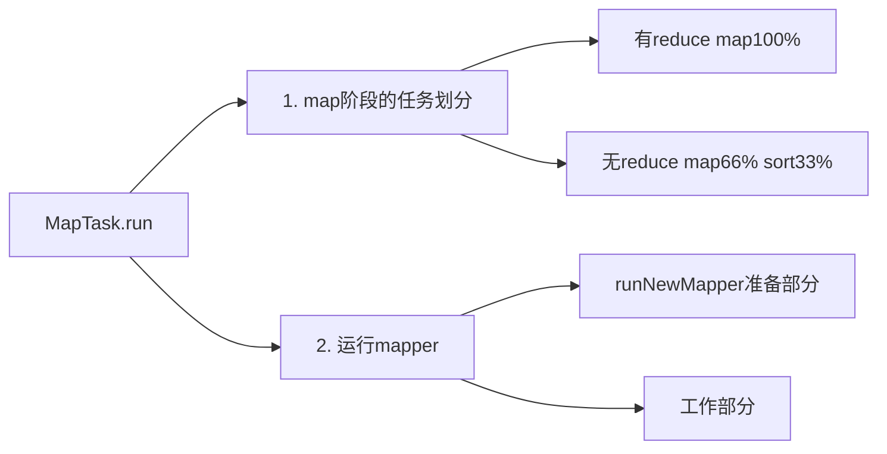

# MapReduce源码

切片

1. 一个Job的Map阶段并行度由客户端在提交Job时的切片数决定
   1. 数据切片是MapReduce程序计算输入数据的单位
2. 每一个Split切片分配一个MapTask并行实例处理
   1. 数据切片只是在逻辑上对输入进行分片，并不会在磁盘上将其切分成片进行存储
3. 默认情况下，切片大小=BlockSize
   1. 三台机子就是3个Block，BlockSize默认就是128（物理）
4. 切片时不考虑数据集整体，而是逐个针对每一个文件单独切片
   1. （小文件?）

在MapReduce具有reducetask阶段的时候，maptask的输出并不只是直接输出到磁盘上的 而是被输出收集器首先收集到内存缓冲区，最终持久化到磁盘。

这个过程称之为MapReduce在Map端的Shuffle过程。主要包括： （1）Partitioner 分区

（2）Circular buffer 内存环形缓冲区 （3）Spill、Sort 溢写、排序 （4）Merge 合并

（5）Combiner 规约 

## MapReduce job

### job.waitForCompletion

```java
waitForCompletion() 
submit();
	// 1建立连接 
	connect(); 
		// 1）创建提交 Job 的代理
		new Cluster(getConfiguration()); 
			// （1）判断是本地运行环境还是 yarn 集群运行环境 
			initialize(jobTrackAddr, conf);

	// 2 提交 job
	submitter.submitJobInternal(Job.this, cluster) 
    // 1）创建给集群提交数据的 Stag 路径
	Path jobStagingArea = JobSubmissionFiles.getStagingDir(cluster, conf);
	// 2）获取 jobid ，并创建 Job 路径
	JobID jobId = submitClient.getNewJobID(); 
	// 3）拷贝 jar 包到集群!!!
	copyAndConfigureFiles(job, submitJobDir); 
	rUploader.uploadFiles(job, jobSubmitDir);
	// 4）计算切片，生成切片规划文件 !!!
	writeSplits(job, submitJobDir);
		maps = writeNewSplits(job, jobSubmitDir); 
		input.getSplits(job);
	// 5）向 Stag 路径写 XML 配置文件 !!!
	writeConf(conf, submitJobFile); 
	conf.writeXml(out);
	// 6）提交 Job,返回提交状态 
	status = submitClient.submitJob(jobId, submitJobDir.toString(),
job.getCredentials());
```

#### submit()

```java
  public void submit() 
         throws IOException, InterruptedException, ClassNotFoundException {
    ensureState(JobState.DEFINE); // 1
    setUseNewAPI();// 2
    connect();// 3
    final JobSubmitter submitter = 
        getJobSubmitter(cluster.getFileSystem(), cluster.getClient());
    status = ugi.doAs(new PrivilegedExceptionAction<JobStatus>() {
      public JobStatus run() throws IOException, InterruptedException, 
      ClassNotFoundException {
        return submitter.submitJobInternal(Job.this, cluster); // 4
      }
    });
    state = JobState.RUNNING;
    LOG.info("The url to track the job: " + getTrackingURL());
   }
```

1. `ensureState(JobState.DEFINE)`

   1.   再次检查确保作业状态为define

2. `setUseNewAPI()`

   1. 新旧api的检验，设置使用新api

3. **==连接集群==**`connect();`

   connect()方法实现，构造集群Cluster实例。Cluster为连接MapReduce集群的一种工具，提供了一种**获取MapReduce集群信息**的方法。在Cluster内部，有一个与集群进行通信的客户端通信协议ClientProtocol实例client，它由ClientProtocolProvider的静态create()方法构造，而Hadoop2.x中提供了两种模式的ClientProtocol，分别为Yarn模式的YARNRunner和Local模式的LocalJobRunner，Cluster实际上是由它们负责与集群进行通信的，而Yarn模式下，ClientProtocol实例YARNRunner对象内部有一个ResourceManager代理ResourceMgrDelegate实例resMgrDelegate，Yarn模式下整个MapReduce客户端就是由它负责与Yarn集群进行通信，完成诸如作业提交、作业状态查询等过程，通过它获取集群的信息。

   ```java
   private synchronized void connect()
           throws IOException, InterruptedException, ClassNotFoundException {
       if (cluster == null) {//若cluster空，则构造Cluster实例
           cluster =
                   ugi.doAs(new PrivilegedExceptionAction<Cluster>() {
                       public Cluster run()
                               throws IOException, InterruptedException,
                               ClassNotFoundException {
                           // 就是这个！！
                           return new Cluster(getConfiguration());
                       }
                   });
       }
   }
   ```

   1. **Cluster**

      1. Cluster的构造方法

         ```JAVA
         public Cluster(InetSocketAddress jobTrackAddr, Configuration conf) 
           throws IOException {
         this.conf = conf;
         this.ugi = UserGroupInformation.getCurrentUser();
         initialize(jobTrackAddr, conf);//初始化方法
         }
         ```

      2. `initialize`初始化干了啥，遍历ClientProtocolProvider抽象类的两种实现

         ```JAVA
         //providerList 0 = {YarnClientProtocolProvider@1924}
         //providerList 1 = {LocalClientProtocolProvider@1925}
         for (ClientProtocolProvider provider : providerList) { ... }
         ```

4. **==提交器==**`submitter.submitJobInternal`

   1. `checkSpecs(job)`

      1. 检查作业的输出规范的有效性。aw:比如检查输出路径是否配置并且是否存在。正确情况是已经配置且不存在

   2. `JobSubmissionFiles.getStagingDir(cluster, conf)`

      1. 获取作业准备区路径，用于作业及相关资源的提交存放,比如：jar、切片信息、配置信息等。默认是/tmp/hadoop-yarn/staging/提交作业用户名/.staging。创建最终作业准备区路径，jobStagingArea后接/jobID

   3. `copyAndConfigureFiles(job, submitJobDir)`

      拷贝作业相关的资源文件到submitJobDir作业准备区，比如：-libjars，-files，-archive

      1. `uploadResources(job, jobSubmitDir)`

         uploadFiles，uploadLibJars，uploadArchives，uploadJobJar把这些提交给集群

   4. **==Create the splits for the job==**

      ```java
        // Create the splits for the job
        LOG.debug("Creating splits at " + jtFs.makeQualified(submitJobDir));
        int maps = writeSplits(job, submitJobDir); //切片个数
        //切片个数就是maptssk个数
        conf.setInt(MRJobConfig.NUM_MAPS, maps); 
        LOG.info("number of splits:" + maps);
      
        int maxMaps = conf.getInt(MRJobConfig.JOB_MAX_MAP,
            MRJobConfig.DEFAULT_JOB_MAX_MAP);
        if (maxMaps >= 0 && maxMaps < maps) {
          throw new IllegalArgumentException("The number of map tasks " + maps +
              " exceeded limit " + maxMaps);
        }
      ```
      
      1. **==切片FileInputFormat.getSplits==**`writeSplits` `getSplits`
         TextInputFormat 是默认的 FileInputFormat 实现类。
         1. 在getSplits方法中，创建了一个集合splits，用于保存最终的切片信息。集合中的每个元素就是一个切片的具体信息
            `List<InputSplit> splits = input.getSplits(job)`
            1. `if (isSplitable(job, path))`这个用来校验文件是否支持切片算法
            2.  `long blockSize = file.getBlockSize();`获取blocksize 128M
            3. `long splitSize = computeSplitSize(blockSize, minSize, maxSize)`块大小等于切片大小，blockSize和maxSize取最小和minSize取最大
            4. `while (((double) bytesRemaining)/splitSize > SPLIT_SLOP) { splits.add }`  SPLIT_SLOP = 1.1
         2. 写入切片信息 `JobSplitWriter.createSplitFiles`
            .job.split.crc / .job.splitmetainfo.crc  / job.split / job.splitrhetainfo 
      2.  `conf.setInt(MRJobConfig.NUM_MAPS, maps)`
      3. `writeConf(conf, submitJobFile)`
         1. 包含的是一些参数信息，把作业配置信息写入作业准备区的job.xml文件中
            .job.xml.crc / job.xml 

5. `state = JobState.RUNNING`


## MapTask





### 1 MapTask.run任务划分

map阶段的任务划分，根据是否有ruduce

```java
    if (isMapTask()) {
      // If there are no reducers then there won't be any sort. Hence the map 
      // phase will govern the entire attempt's progress.
      if (conf.getNumReduceTasks() == 0) {
        mapPhase = getProgress().addPhase("map", 1.0f); 
      } else {
        // 如果有reducetask的话，map阶段占据67%，sort阶段占据33%
        // 为什么要sort 因为要shuffle给reducetask
        mapPhase = getProgress().addPhase("map", 0.667f);
        sortPhase  = getProgress().addPhase("sort", 0.333f);
      }
    }
```

运行runNewMapper

```java
if (useNewApi) {
  runNewMapper(job, splitMetaInfo, umbilical, reporter);
} else {
  runOldMapper(job, splitMetaInfo, umbilical, reporter);
}
done(umbilical, reporter);
```

### 2.1 MapTask.runNewMapper 准备部分

默认启用

1. 创建上下文对象 taskContext / mapContext
2. 重构输入切片信息 input split
3. 创建读取数据组件TextinputFormat
   1. 具体的读取数据组件RecordReader (LineRecordReader)`NewTrackingRecordReader`
4. 创建Mapper类实例 也就是用户自己写Mapper代码
5. 创建outputCollector 用于把map处理的收集

### 2.2 MapTask.runNewMapper 工作部分


```java
try {
  input.initialize(split, mapperContext); // 1 从切片读取数据
  mapper.run(mapperContext);// 2 调用map方法处理数据
  mapPhase.complete();
  setPhase(TaskStatus.Phase.SORT);
  statusUpdate(umbilical);
  input.close();
  input = null;
  output.close(mapperContext);
  output = null;
} finally {
  closeQuietly(input);
  closeQuietly(output, mapperContext);
}
```

#### 1 从切片读取数据

`RecoderReader.initialize `抽象方法由`LineRecorderReader`实现

1. 获取切片位置信息 计算长度
2. 判断切片是否是压缩的 压缩是否可切分(不可分就一个文件读)
3. open切片数据 读取数据
   1. 根据回车换行符一行一行读取数据 \r \n 
   2. 返回<k，v>k：每行起始位置偏移量  v：这一行的内容

#### 2 调用map方法处理数据

`mapper.run(mapperContext)`

1. 判断nextKeyValue()

   1. 为true就意味着还有数据

2. 调用map方法已经在我们自己定义的Mapper类中重写了

   1. LineRecorderReader每读取一行就返回一个kv键值对，调用一次map方法

   ```java
   while (context.nextKeyValue()) {
       map(context.getCurrentKey(), context.getCurrentValue(), context);
   }
   ```


#### 3 调用OutputCollector收集map输出的结果

如果有reduce阶段 NewOutputCollector 把数据收集到环形缓冲区`MapOutputBuffer`。如果没有reduce阶段 NewDirectOutputCollector 把数据直接输出

```java
 // NewOutputCollector
 // 创建map输出收集器
  collector = createSortingCollector(job, reporter);
  partitions = jobContext.getNumReduceTasks();// = 获取分区的个数 = reducetask个数
  if (partitions > 1) {
    // 如果分区数大于1 获取分区实现类 默认：HashPartitioner
    partitioner = (org.apache.hadoop.mapreduce.Partitioner<K,V>)
      ReflectionUtils.newInstance(jobContext.getPartitionerClass(), job);
  } else {
    // 进入这里表示不需要进行分区操作 所有的数据分区值计算返回 reduce 个数-1
    partitioner = new org.apache.hadoop.mapreduce.Partitioner<K,V>() {
      @Override
      public int getPartition(K key, V value, int numPartitions) {
        return partitions - 1;
      }
    };
  }
```

1. 创建输出的收集器`createSortingCollector`

   1. 环形缓冲区`MapOutputBuffer.class`

2. 判断使用什么分区器 

   partitions = jobContext.getNumReduceTasks();

   1. 分区数(ReduceTasks) > 1  `HashPartitioner`
      `(key.hashCode() & Integer.MAX_VALUE) % numReduceTasks;`
   2. 分区数(ReduceTasks) = 1 `partitions - 1`


### Mapper

#### 1 Partitioner 

计算分区，每个分区应该放进哪个reducetask

 (key.hashCode() & Integer.*MAX_VALUE*) % numReduceTasks;

ReduceTasks =  3，


#### 2 Circular buffer


**初始化**

1. IntBuffer kvmeta 
   存储元数据信息 四个int
   1. int VALSTART = 0  value的起始位置
   2. int KEYSTART = 1 key的起始位置
   3. int PARTITION = 2 partition
   4. int VALLEN = 3 value的长度
2. int equator 
   分割标识
3. 创建排序类 sorter = QuickSort.class
4. byte[] kvbuffer 
   内存缓冲区的核心 存储key value序列化之后的数据 注意是字节数组
5. 环形缓冲区大小
   1. DEFAULT_IO_SORT_MB = 100，maxMemUsage = sortmb << 20;

**数据收集**

1. key/value按照索引递增的方向存储，meta则按照索引递减的方向存储，将其数组抽象为一个环形结构之后，以equator为界，key/value顺时针存储，meta逆时针存储。
2. 收集数据到环形缓冲区核心逻辑有：序列化key到字节数组，序列化value到字节数组，写入该条数据的元数据（起始位置、partition、长度）、更新kvindex。
3. kvindex每次都是向下跳四个“格子”，然后再向上一个格子一个格子地填充四元组的数据。
   1. 比如kvindex初始位置是—4，当第一个写完之后，（Kvindex＋0）的位置存放value的起始位置、（Kvindex＋1）的位置存放key的起始位置、（Kvindex＋2）的位置存放partition的值、（Kvindex＋3）的位置存放value的长度，然后Kvindex跳到-8位 置

#### 3 Spill、Sort

```java
private void startSpill() {
  assert !spillInProgress;
  kvend = (kvindex + NMETA) % kvmeta.capacity();
  bufend = bufmark;
  spillInProgress = true;
  LOG.info("Spilling map output");
  LOG.info("bufstart = " + bufstart + "; bufend = " + bufmark +
           "; bufvoid = " + bufvoid);
  LOG.info("kvstart = " + kvstart + "(" + (kvstart * 4) +
           "); kvend = " + kvend + "(" + (kvend * 4) +
           "); length = " + (distanceTo(kvend, kvstart,
                 kvmeta.capacity()) + 1) + "/" + maxRec);
  spillReady.signal();
}
```

**spill**

1. 环形缓冲区虽然可以减少IO次数，但是总归有容量限制，不能把所有数据一直写入内存，数据最终还是要落入磁盘上存储的，所以需要在一定条件下将缓冲区中的数据临时写入磁盘，然后重新利用这块缓冲区。这个从**内存往磁盘写数据的过程被称为Spill**。
2. 这个溢写是由单独线程来完成，不影响往缓冲区继续写数据。整个缓冲区有个溢写的比例spill.percent。这个比例默认是**0.8**，也就是当缓冲区的数据已经达到阈值（buffer size *spill percent = 100MB* 0.8 = **80MB**），spill线程启动。
3. `spillReady.signal()`唤醒`SpillThread`, 再由核心方法`sortAndSpill()`

**sort**

1. 在溢写到磁盘的过程中，会对数据进行排序。
2. 排序规则是`MapOutputBuffer.compare`，采用的是**QuickSort快速排序**。
3. 先对partition进行排序其次对key值排序。这样，数据按分区排序（同一partition的放在一起），并且在每个分区内按键对元数据`kvmeta`排序。
4. kvmeta中的元数据先排序，引导kvbuffer中的真实数据溢写。

#### 4 *Combiner

1. Combiner（规约）的作用就是对map端的输出先做一次局部合并，以减少在map和reduce节点之间的数据传输量，以提高网络IO性能，是MapReduce的一种优化手段之一。默认情况下不开启。
2. 当job设置了Combiner，可能会在spill和merge的两个阶段执行。

#### 5 Merge

1. 每次spill都会在磁盘上生成一个临时文件，如果map的输出结果真的很大，有多次这样的spill发生，磁盘上相应的就会有多个临时文件存在。这样将不利于reducetask处理数据。
2. 当mapper和最后一次溢出都结束时，溢出线程终止，**合并（merge）**阶段开始。
3. 在合并阶段，应将所有溢出文件合并在一起以形成一个map输出文件。
4. 默认情况下，一个合并过程最多可以处理100个溢出文件（负责此操作的参数是mapreduce.task.io.sort.factor）。如果超过，将进行多次merge合并。
5. 最终一个maptask的结果是一个输出文件，其中包含map的所有输出数据以及索引文件，索引文件描述了ReduceTask的分区开始-停止信息，以便能够轻松获取与其将运行的相关分区数据


## Reduce


### 

1. 对Reduce阶段任务的划分

2. Reduce端shuffe相关的操作

   1. codec编解码器
   2. CombineOutputCollector输出收集器
   3. shuffleConsumerPlugin（负责reduce端shuffle插件）
      1. init初始化
      2. run运行
   4. GroupingComparator分组比较器

3. 运行Reduce runNewReducer

   1. 准备部分
      创建和Reduce处理数据相关的组件

      1. 创建Reduce类的实例 该实例通常由用户编写 继承Reduce父类
      2. 创建数据输出组件 默认是TextOutPutFormation
      3. 上下文对象 taskContext / reduceContext

   2. 工作部分
      真正Reduce处理数据

      1. reduce.run


### 1 ReduceTask.run 

**reduce阶段的任务划分**

```java
public void run(JobConf job, final TaskUmbilicalProtocol umbilical)
    throws IOException, InterruptedException, ClassNotFoundException {
    job.setBoolean(JobContext.SKIP_RECORDS, isSkipping());
      
    if (isMapOrReduce()) {
      copyPhase = getProgress().addPhase("copy");
      sortPhase  = getProgress().addPhase("sort");
      reducePhase = getProgress().addPhase("reduce");
    // check if it is a cleanupJobTask
        
    // Initialize the codec
    
    //shuffle开始了
    ShuffleConsumerPlugin.Context shuffleContext = 
        new ShuffleConsumerPlugin.Context(getTaskID(), job, FileSystem.getLocal(job), umbilical, 
                  super.lDirAlloc, reporter, codec, 
                  combinerClass, combineCollector, 
                  spilledRecordsCounter, reduceCombineInputCounter,
                  shuffledMapsCounter,
                  reduceShuffleBytes, failedShuffleCounter,
                  mergedMapOutputsCounter,
                  taskStatus, copyPhase, sortPhase, this,
                  mapOutputFile, localMapFiles);
    shuffleConsumerPlugin.init(shuffleContext);
    rIter = shuffleConsumerPlugin.run();
        
	// free up the data structures
    mapOutputFilesOnDisk.clear();
        
    sortPhase.complete(); // sort is complete
    setPhase(TaskStatus.Phase.REDUCE);  // 进入reduce阶段
    statusUpdate(umbilical);
    Class keyClass = job.getMapOutputKeyClass();
    Class valueClass = job.getMapOutputValueClass();
    RawComparator comparator = job.getOutputValueGroupingComparator(); // 获取分组比较器
        
   	if (useNewApi) {
      runNewReducer(job, umbilical, reporter, rIter, comparator, 
                    keyClass, valueClass);
    } else {
      runOldReducer(job, umbilical, reporter, rIter, comparator, 
                    keyClass, valueClass);
    }

    shuffleConsumerPlugin.close();
    done(umbilical, reporter);
    
}
```

**shuffle操作**

1. codec编解码器
   1. 如果map的输出进行了压缩编码，这里就初始化解码器，用于解压缩
2. CombineOutputCollector输出收集器
   1. 判断用户是否设置了combiner，如果是创建combiner输出收集器
3. shuffleConsumerPlugin（负责reduce端shuffle插件）
   1. init初始化
   2. run运行
4. GroupingComparator分组比较器
   1. 获取分组比较器

**运行reducer**


### 2 ReduceTask.runNewReducer 准备部分

1. 创建task上下文

2. 创建用户编写设置的reducer类

   `ReflectionUtils.newInstance(taskContext.getReducerClass(), job)`

3. 创建FileOutputFormat输出数据，默认实现类是TextOutputFormat。

   `new NewTrackingRecordWriter<OUTKEY, OUTVALUE>(this, taskContext)`

4. 创建ReduceContext对象，将shuffle结果rIter，

### 3 ReduceTask.runNewReducer 工作部分

1. 发多少


#### 3.1 Shuffle.init

`shuffleConsumerPlugin.init(shuffleContext)`初始化，接口的实现类是`Shuffle.class`，`Shuffle.init`返回的是一个`MergeManagerImpl`。创建MergeManagerImpl类，核心的有：确定shuffle时的一些条件、是否允许内存到内存合并、启动两个merge线程，分别为inMemoryMerger和onDiskMerger，分别将内存中的数据merge到磁盘和将磁盘中的数据进行。

**1 shuffle条件**

1. maxInMemCopyUse，reduce最大可用内存的比例
   1. DEFAULT_SHUFFLE_INPUT_BUFFER_PERCENT = 0.70f
2. memoryLimit 最大用于shuffle的内存
   1. maxMemory() * maxInMemCopyUse
3. ioSortFactor 排序文件一次merge合并的数量
   1. DEFAULT_IO_SORT_FACTOR = 10
4. singleShuffleMemoryLimitPercent 单次shuffle可用最大百分比
   1. DEFAULT_SHUFFLE_MEMORY_LIMIT_PERCENT  = 0.25f

**2 启动MemToMemMerge**

1. 因为fetch来数据首先放入在内存中的，正常情况下在内存中对数据进行合并是最快的，可惜的是，默认情况下，是不开启内存到内存的合并的。
2. 内存到内存的merge合并，默认为false。
   `REDUCE_MEMTOMEM_ENABLED = "mapreduce.reduce.merge.memtomem.enabled"`

```java
boolean allowMemToMemMerge = 
  jobConf.getBoolean(MRJobConfig.REDUCE_MEMTOMEM_ENABLED, false);
if (allowMemToMemMerge) {
  this.memToMemMerger = 
    new IntermediateMemoryToMemoryMerger(this,
                                         memToMemMergeOutputsThreshold);
  this.memToMemMerger.start();
} else {
  this.memToMemMerger = null;
}
```

**3 启动inMemoryMerger**

1. 内存到磁盘

```java
this.inMemoryMerger = createInMemoryMerger();
this.inMemoryMerger.start();
```

**4 启动onDiskMerger**

1. 磁盘到磁盘

```java
this.onDiskMerger = new OnDiskMerger(this);
this.onDiskMerger.start();
```

---


#### 3.2 Shuffle.run()

**1  eventFetcher线程**

创建EventFetcher线程是为了获取已完成的maps列表

```java
final EventFetcher<K,V> eventFetcher = 
  new EventFetcher<K,V>(reduceId, umbilical, scheduler, this,
      maxEventsToFetch);
eventFetcher.start();
```

**2 fetchers线程**

真正拉取数据的线程

1. 本地模式 1 个线程
2. 其他模式 5 个线程，数据存储在不同的机器

```java
boolean isLocal = localMapFiles != null; // 本地文件路径不为空就代表是本地模式
final int numFetchers = isLocal ? 1 :
  jobConf.getInt(MRJobConfig.SHUFFLE_PARALLEL_COPIES, 5);
Fetcher<K,V>[] fetchers = new Fetcher[numFetchers];
if (isLocal) { // 本地模式
  fetchers[0] = new LocalFetcher<K, V>(jobConf, reduceId, scheduler,
      merger, reporter, metrics, this, reduceTask.getShuffleSecret(),
      localMapFiles);
  fetchers[0].start();
} else {
  for (int i=0; i < numFetchers; ++i) {
    fetchers[i] = new Fetcher<K,V>(jobConf, reduceId, scheduler, merger, 
                                   reporter, metrics, this, 
                                   reduceTask.getShuffleSecret());
    fetchers[i].start();
  }
}
```

---


### 3.3 Shuffle-Copy阶段

Reduce进程启动一些数据copy线程(**Fetcher**)，通过HTTP方式请求maptask获取属于自己的文件。

**MapHost.class**

```java
// 
public enum State {
    IDLE,               // 空闲
    BUSY,               // 繁忙正在fetcher
    PENDING,            // 待处理，等待fetcher
    PENALIZED           // 被惩罚，shuffle失败的主机
}
```

#### **Fetcher.run()**

```java
  while (!stopped && !Thread.currentThread().isInterrupted()) {
    MapHost host = null;
    try {
      merger.waitForResource(); // 如果reduce在merge则暂停merge
      host = scheduler.getHost(); // 获取处于PENDING待处理状态的主机
      metrics.threadBusy(); //
      copyFromHost(host); //核心方法
    } finally {
      if (host != null) {
        scheduler.freeHost(host);
        metrics.threadFree();            
      }
    }
  }
```

**I Fetcher.copyFromHost**

拉取数据的核心方法

```java
URL url = getMapOutputURL(host, maps); // 构造URL并连接
DataInputStream input = null;
try {
  input = openShuffleUrl(host, remaining, url); // 建立拉取数据的输入流
  if (input == null) {
    return;
  }

  TaskAttemptID[] failedTasks = null;
  while (!remaining.isEmpty() && failedTasks == null) {
    try {
      failedTasks = copyMapOutput(host, input, remaining, fetchRetryEnabled); //【核心】
    } catch (IOException e) {
      IOUtils.cleanupWithLogger(LOG, input);
      connection.disconnect();
      url = getMapOutputURL(host, remaining);
      input = openShuffleUrl(host, remaining, url);
      if (input == null) {
        return;
      }
    }
  }
```

**II Fetcher.copyMapOutput**

首先进行判断copy过来的数据放置在哪里？优先内存，超过限制放置磁盘。

```java
  try {
    // 首先进行判断copy过来的数据放置在哪里？优先内存，超过限制放置磁盘。
    mapOutput = merger.reserve(mapId, decompressedLength, id);
  } catch (IOException ioe) {
    ioErrs.increment(1);
    scheduler.reportLocalError(ioe);
    return EMPTY_ATTEMPT_ID_ARRAY;
  }
  if (mapOutput == null) {
    LOG.info("fetcher#" + id + " - MergeManager returned status WAIT ...");
    return EMPTY_ATTEMPT_ID_ARRAY;
  } 

  try {
    LOG.info("fetcher#" + id + " about to shuffle output of map "
        + mapOutput.getMapId() + " decomp: " + decompressedLength
        + " len: " + compressedLength + " to " + mapOutput.getDescription());
    mapOutput.shuffle(host, is, compressedLength, decompressedLength,
        metrics, reporter); // 【核心】
  } catch (java.lang.InternalError | Exception e) {
    LOG.warn("Failed to shuffle for fetcher#"+id, e);
    throw new IOException(e);
  }
```

**III MapOutput.shuffle**

```java
// MapOutput.shuffle
public abstract void shuffle(MapHost host, InputStream input,
                           long compressedLength,
                           long decompressedLength,
                           ShuffleClientMetrics metrics,
                           Reporter reporter) throws IOException;

// IFileWrappedMapOutput.shuffle
@Override  
public void shuffle(MapHost host, InputStream input,
                  long compressedLength, long decompressedLength,
                  ShuffleClientMetrics metrics,
                  Reporter reporter) throws IOException {
doShuffle(host, new IFileInputStream(input, compressedLength, conf),
    compressedLength, decompressedLength, metrics, reporter);
}
// IFileWrappedMapOutput.doShuffle
protected abstract void doShuffle(
	MapHost host, IFileInputStream iFileInputStream,
    long compressedLength, long decompressedLength,
    ShuffleClientMetrics metrics, Reporter reporter) throws IOException;
// InMemoryMapOutput
// OnDiskMapOutput

```

---


### 3.4 Shuffle-Merge

对于从属于不同maptask拉取过来的数据，需要进行merge合并成完整的数据，最终调reduce方法进行业务处理。reduce的merge合并分为3种：内存到内存合并、内存到磁盘合并、磁盘到磁盘合并。

哪到哪指的是：合并之前数据在哪里以及合并之后的数据放置在哪里。其中内存到内存合并，默认不开启，因此我们通常关注后两种合并。

Shuffle. init——> createMergeManager—-> new MergeManagerImpl

```JAVA
// MergeManagerImpl
this.inMemoryMerger = createInMemoryMerger();
this.inMemoryMerger.start(); //开启线程
this.onDiskMerger = new OnDiskMerger(this);
this.onDiskMerger.start(); // 本质是一个MergeThread线程 进入线程run方法。
```


**InMemoryMerger.merge**

**OnDiskMerger.merge**


```java
  // 1. 准备要合并的磁盘列表
  for (CompressAwarePath file : inputs) {
    approxOutputSize += localFS.getFileStatus(file).getLen();
  }

  // 添加校验和长度
  approxOutputSize += 
    ChecksumFileSystem.getChecksumLength(approxOutputSize, bytesPerSum);

  // 2. 开始磁盘合并
  Path outputPath = 
    localDirAllocator.getLocalPathForWrite(inputs.get(0).toString(), 
        approxOutputSize, jobConf).suffix(Task.MERGED_OUTPUT_PREFIX);

  FSDataOutputStream out = CryptoUtils.wrapIfNecessary(jobConf, rfs.create(outputPath));
  Writer<K, V> writer = new Writer<K, V>(jobConf, out,
      (Class<K>) jobConf.getMapOutputKeyClass(),
      (Class<V>) jobConf.getMapOutputValueClass(), codec, null, true);

  RawKeyValueIterator iter  = null;
  CompressAwarePath compressAwarePath;
  Path tmpDir = new Path(reduceId.toString());
  try {
    iter = Merger.merge(jobConf, rfs,
                        (Class<K>) jobConf.getMapOutputKeyClass(),
                        (Class<V>) jobConf.getMapOutputValueClass(),
                        codec, inputs.toArray(new Path[inputs.size()]), 
                        true, ioSortFactor, tmpDir, 
                        (RawComparator<K>) jobConf.getOutputKeyComparator(), 
                        reporter, spilledRecordsCounter, null, 
                        mergedMapOutputsCounter, null);

    Merger.writeFile(iter, writer, reporter, jobConf);
    writer.close();
    compressAwarePath = new CompressAwarePath(outputPath,
        writer.getRawLength(), writer.getCompressedLength());
  } catch (IOException e) {
    localFS.delete(outputPath, true);
    throw e;
  }
```

Shuffl.run()

```
    // Finish the on-going merges...
    RawKeyValueIterator kvIter = null;
    try {
      kvIter = merger.close();
    } catch (Throwable e) {
      throw new ShuffleError("Error while doing final merge " , e);
    }
```

MergeManagerImpl 

```java
  @Override
  public RawKeyValueIterator close() throws Throwable {
    // Wait for on-going merges to complete
    if (memToMemMerger != null) { 
      memToMemMerger.close();
    }
    inMemoryMerger.close();
    onDiskMerger.close();
    
    List<InMemoryMapOutput<K, V>> memory = 
      new ArrayList<InMemoryMapOutput<K, V>>(inMemoryMergedMapOutputs);
    inMemoryMergedMapOutputs.clear();
    memory.addAll(inMemoryMapOutputs);
    inMemoryMapOutputs.clear();
    List<CompressAwarePath> disk = new ArrayList<CompressAwarePath>(onDiskMapOutputs);
    onDiskMapOutputs.clear();
    return finalMerge(jobConf, rfs, memory, disk); //finalMerge
  }
   
```

finalMerge

```java
  
private RawKeyValueIterator finalMerge(JobConf job, FileSystem fs,
                                   List<InMemoryMapOutput<K,V>> inMemoryMapOutputs,
                                   List<CompressAwarePath> onDiskMapOutputs
                                   ) throws IOException {
...
    //获取用于比较key的比较器 如果用户未设置 使用Writercomparator规则比较 即自然序
    final RawComparator<K> comparator =
      (RawComparator<K>)job.getOutputKeyComparator();
}
```


### Shuffle-Sort阶段

在合并的过程中，会对数据进行Sort排序，默认情况下是key的字典序（WritableComparable），如果用户设置比较器，则以用户设置的为准。

```java
//获取用于比较key的比较器 如果用户未设置 使用Writercomparator规则比较 即自然序
final RawComparator<K> comparator =
  (RawComparator<K>)job.getOutputKeyComparator();
```

判断用户是否定义了分组比较器，是否定义了KEY_COMPARATOR key比较器。都没有的话使用默认的WritertableComparable

```java
  public RawComparator getOutputKeyComparator() {
    Class<? extends RawComparator> theClass = getClass(
      JobContext.KEY_COMPARATOR, null, RawComparator.class);
    if (theClass != null)
      return ReflectionUtils.newInstance(theClass, this);
    return WritableComparator.get(getMapOutputKeyClass().asSubclass(WritableComparable.class), this);
  }
```


### Reducer

merge:

<hello,1><hello,1><hello,1><hadoop,1><hadoop,1> 

Sort: 默认key的字典序排序

<hadoop,1><hadoop,1><hello,1><hello,1><hello,1> 

reduce端shuffle结束 开始reduce方法处理数据

<hadoop,1><hadoop,1>          -->     <commonkey,Iterable[1,1]> 

<hello,1><hello,1><hello,1>    -->     <commonkey,Iterable[1,1,1]> 

分组构成一个新的kv键值对，value是这一组所有的v构成的一个迭代器

```java
  private <INKEY,INVALUE,OUTKEY,OUTVALUE>
  void runNewReducer(JobConf job,
                     final TaskUmbilicalProtocol umbilical,
                     final TaskReporter reporter,
                     RawKeyValueIterator rIter,
                     RawComparator<INKEY> comparator,
                     Class<INKEY> keyClass,
                     Class<INVALUE> valueClass
                     ) throws IOException,InterruptedException, 
                              ClassNotFoundException {
    // wrap value iterator to report progress.
    final RawKeyValueIterator rawIter = rIter;
    rIter = new RawKeyValueIterator() {
      public void close() throws IOException {
        rawIter.close();
      }
      public DataInputBuffer getKey() throws IOException {
        return rawIter.getKey();
      }
      public Progress getProgress() {
        return rawIter.getProgress();
      }
      public DataInputBuffer getValue() throws IOException {
        return rawIter.getValue();
      }
      public boolean next() throws IOException {
        boolean ret = rawIter.next();
        reporter.setProgress(rawIter.getProgress().getProgress());
        return ret;
      }
    };
    // make a task context so we can get the classes
    org.apache.hadoop.mapreduce.TaskAttemptContext taskContext =
      new org.apache.hadoop.mapreduce.task.TaskAttemptContextImpl(job,
          getTaskID(), reporter);
    // make a reducer
    org.apache.hadoop.mapreduce.Reducer<INKEY,INVALUE,OUTKEY,OUTVALUE> reducer =
      (org.apache.hadoop.mapreduce.Reducer<INKEY,INVALUE,OUTKEY,OUTVALUE>)
        ReflectionUtils.newInstance(taskContext.getReducerClass(), job);
    org.apache.hadoop.mapreduce.RecordWriter<OUTKEY,OUTVALUE> trackedRW = 
      new NewTrackingRecordWriter<OUTKEY, OUTVALUE>(this, taskContext);
    job.setBoolean("mapred.skip.on", isSkipping());
    job.setBoolean(JobContext.SKIP_RECORDS, isSkipping());
    org.apache.hadoop.mapreduce.Reducer.Context 
         reducerContext = createReduceContext(reducer, job, getTaskID(),
                                               rIter, reduceInputKeyCounter, 
                                               reduceInputValueCounter, 
                                               trackedRW,
                                               committer,
                                               reporter, comparator, keyClass,
                                               valueClass);
    try {
      reducer.run(reducerContext);
    } finally {
      trackedRW.close(reducerContext);
    }
  }
```

Reducer

```java
  public void run(Context context) throws IOException, InterruptedException {
    setup(context);
    try {
      while (context.nextKey()) {
        reduce(context.getCurrentKey(), context.getValues(), context);
        // If a back up store is used, reset it
        Iterator<VALUEIN> iter = context.getValues().iterator();
        if(iter instanceof ReduceContext.ValueIterator) {
          ((ReduceContext.ValueIterator<VALUEIN>)iter).resetBackupStore();        
        }
      }
    } finally {
      cleanup(context);
    }
  }
```

---


### OutputFormat

- reduce阶段的最后是通过调用context.write方法将数据写出的。
- 负责输出数据的组件叫做OutputFormat，默认实现是TextOutPutFormat。
- 而真正负责写数据的组件叫做LineRecordWriter，Write方法就定义在其中，这一点和输入组件很是类似。

 LineRecordWriter的行为是一次输出写一行，再有输出换行写。

 在构造LineRecordWriter的时候，已经设置了输出的key,value之间是以\t制表符分割的。


https://fast.lycorisrecoil.org/link/AjWKAbCBkmziqgzZ?ssd=1

https://fast.lycorisrecoil.org/link/AjWKAbCBkmziqgzZ?sub=1

https://fast.lycorisrecoil.org/link/AjWKAbCBkmziqgzZ?clash=1

https://fast.lycorisrecoil.org/link/AjWKAbCBkmziqgzZ?clash=1
